## VIDGER Tutorial

### Table of Contents
1. [Accessibility](#accessibility)
2. [Input Data](#input-data)
3. [Expedited Analysis](#expedited-analysis)
	* [Submit and QC](#ea-subqc)
4. [In-depth Analysis](#indepth-analysis)
	* [Submit and QC](#ia-subqc)
	* [Preliminary Analsysis](#ia-prelim-analysis)
	* [DGE Analysis](#ia-dge-analysis)

***

### Accessibility <a id="accessibility"></a>
VIDGER can be freely accessed directly through [bmbl.sdstate.edu/VIDGER/](http://bmbl.sdstate.edu/VIDGER/) or through R using the following commands:

```{r}
if (!require("shiny")) install.packages("shiny")
shiny::runGitHub("vidger-shiny", "btmonier")
```

Typically, the link will provide an easier route to using VIDGER.  In circumstances where internet connections will be limited (such as during travel), loading VIDGER through R while internet is still available will allow users to utilize VIDGER without an internet connection later on.

<br>

### Input Data <a id="input-data"></a>
VIDGER requires two pieces of information for analysis.  The first is an expression estimation matrix, also referred to as a count matrix, displaying the gene expression estimates for each sample.  The format requires a CSV file with the row names to list the gene IDs and column names to list the sample IDs.  The second required input is a condition matrix, wherein the factor levels for each sample are provided.  This file requires a CSV format and row names to be the sample IDs matching the sample IDs from the expression estimation matrix and the column names to be the condition factors.

The data used for this tutorial are derived from 28 *Vitis vinifera* samples with three distinct factors (Rootstock, row, and block).

**Expression Matrix (first 4 samples IDs):**  

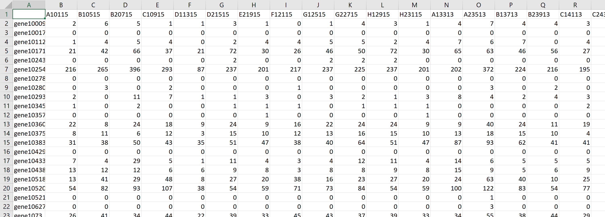  

**Condition Matrix:**

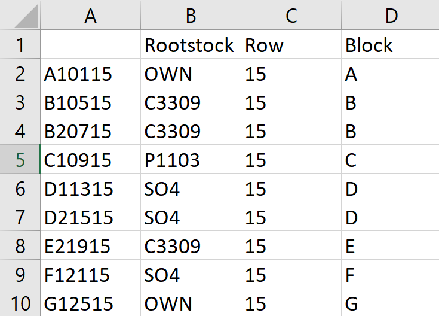

<br>

### Expedited Analysis <a id="expedited-analysis"></a>
Expedited analysis is for users who want a quick and efficient method of producing DGE results using the default parameters and tools in VIDGER. 

#### Submit and QC <a id="ea-subqc"></a>
1. Load user data by selecting “Load my own data”
	* User data requires one count matrix and one condition matrix

2. Click “Submit” to load the data.

	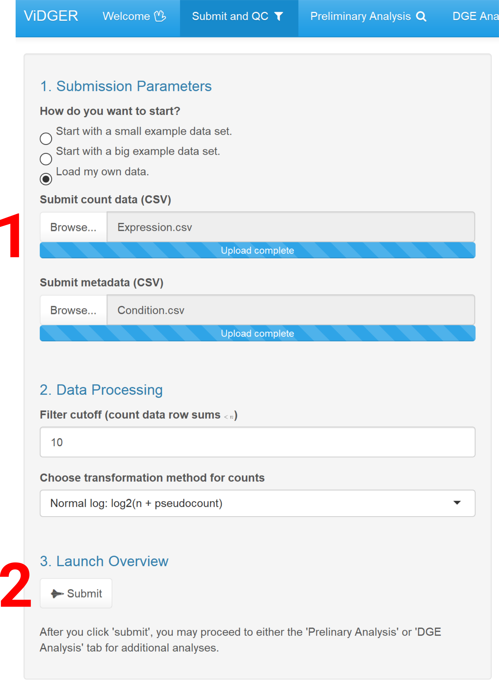

3. After submitting the data, proceed to the “DGE Analysis” tab at the top.
	* If a specific experimental design other than the basic two-group comparison is required, select it accordingly.  

4. Select the factor of interest and check the boxes for the comparisons of interest.  

	**NOTE:** you must choose at least one comparison for "two-group comparisons" or "multiple factor comparisons" experimental design options or else an error will occur!

5. Submit the parameters to perform DGE analysis.

	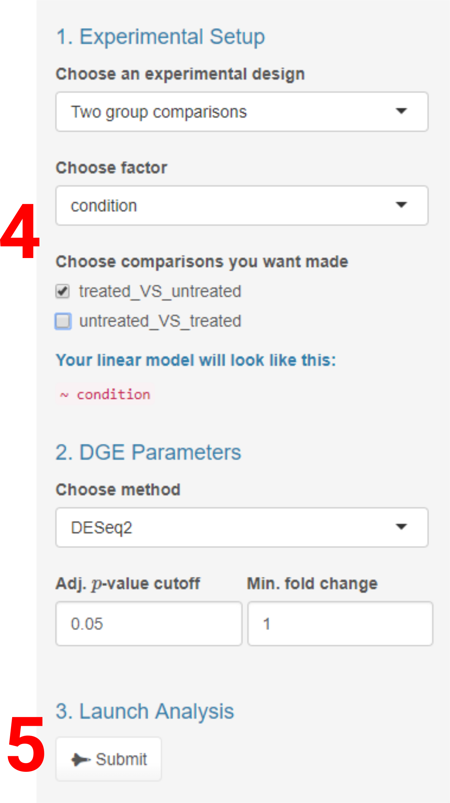

6. Select the “Plots” subtab to view the DGE results table towards the bottom.

7. Select “Download All Data” at the bottom of this page to download the results file.  

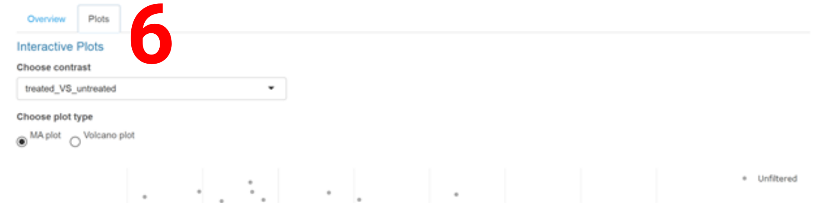

<br>
<br>

### In-depth Analysis <a id="indepth-analysis"></a>

#### Submit and QC <a id="ia-subqc"></a>
1. Select either “Start with some example data” to use provided example data or “Load my own data” to upload user data. 
	* User data requires one count matrix and one condition matrix

2. Select a filter cutoff to simplify and speed computations by eliminating any rows that have below specified expression totals. The default here is 10.

3. Select a transformation method for the count data for displaying the expression estimate.

4. Click “Submit” to submit the two input values or to extract the example data, which provides additional tabs adjacent to the submission box

	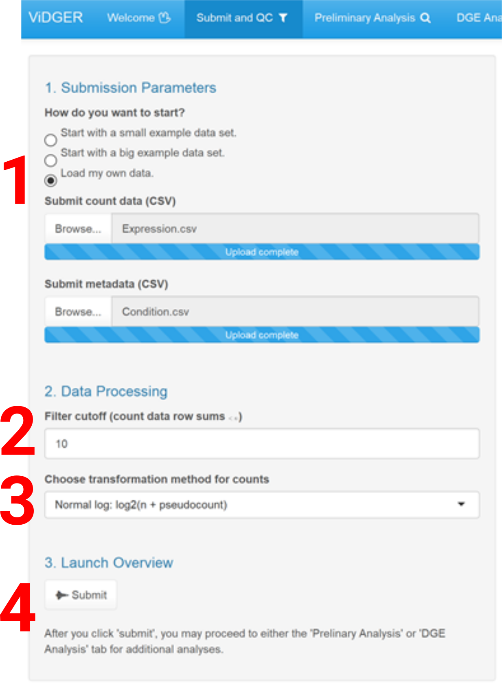

5. "File Summary" provides a glimpse into the submitted data, including the first and last five rows of the count data, and pre- and post-filtered IDs.

	

6. “Count Summary” provides three interactive, downloadable visualizations based on the count file based on each sample. Box-and-Whisker Plot for transformed read counts by sample with interactivity showing the quartiles, maximum, and minimum count. **With the example data, it appears that the box-and-whisker plot for each sample is similar to the other samples. If one sample had a plot varying greatly from the other’s, it would indicate some required investigation into that specific sample in terms of the number of raw reads provided and proportion of reads aligned.**  

	  

	Count Data Distribution plot showing the frequency of transformed count data by sample with interactivity displaying the value and frequency.  Additionally, double-clicking a sample ID in the legend isolates just that sample’s histogram. Additional sample IDs can be select for more specific comparisons also. **With the example data, the histograms appear similar for each sample, indicating no significant derivation. Similar to the box-and-whisker plots, a single sample varying greatly from other samples may indicate a required investigation into the raw read counts or read alignment statistics.**  

	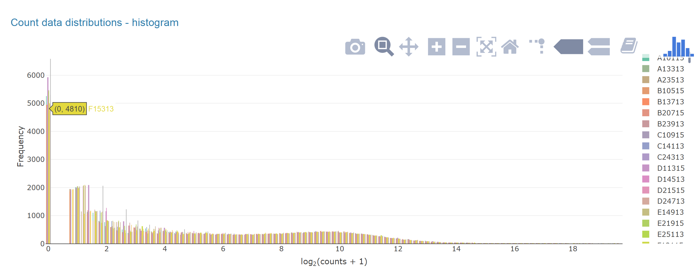

	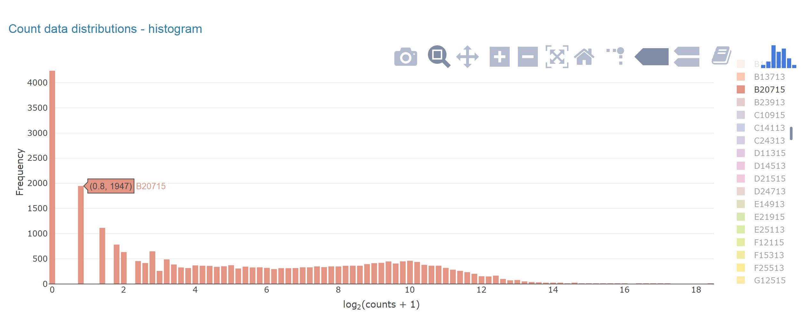  

	Total Reads displays a histogram of total reads by sample with interactivity for displaying actual total read counts for each sample. Double-clicking on a sample ID in the legend isolates that sample’s read count histogram and allows for selecting of specific adjacent sample IDs for comparison. **Total reads counts for individual samples that vary greatly from the other total read counts may indicate some issues with data preparation (sequencing) or read alignment. Here, sample H26313 has a much lower total reads count than the other samples. This may be reflected in further comparative analyses.**

#### Preliminary Analysis <a id="ia-prelim-analysis"></a>
1. After proceeding to the “Preliminary Analysis” tab, “Correlation” provides correlation analysis of the expression matrix by sample. Interactive Correlation Analysis displays a heatmap of the correlation between samples with interactivity showing the actual correlation between the two intersecting samples. **The example data shows most sample-sample correlations of 0.95 or larger, indicating relatively high correlation. The darker cells here signify less similar samples, which may yield more interesting differential expression results. This graph can indicate comparisons of interest in future analyses.  In most cases, the high number of gene IDs with similar or identical expression estimates will cause correlations to be large, even for dissimilar genetic expression profiles.**  

	  

	Clicking on a cell will provide a scatterplot of the two intersecting samples with each data point representing one gene ID. A scatterplot with points falling more closely along the diagonal indicates samples with more similar genetic expression profiles. **This scatterplot shows a clear trend of data points (gene IDs) falling along or close to the diagonal. That means these two samples have very similar genetic expression profiles. Data points that fall far from the diagonal line represent genes with dissimilar expression levels between the select samples.**

	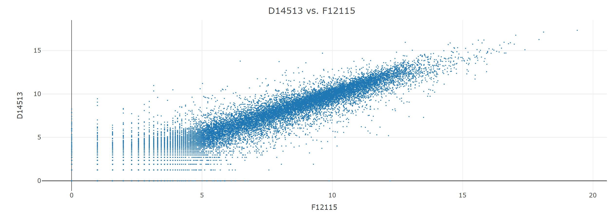  

	The Sample Distance Matrix provides a heatmap of the Euclidean distance between the gene expression vectors for each sample pair. The larger distance (darker red color) indicates samples with the most dissimilar genetic expression profiles. **This matrix also includes a clustering of the samples based on the vectorized expression profiles. With the example data, two distinct clusters can be observed through the first branching of the dendogram. Additionally, as with the correlation heatmap, specific cells with a darker color indicate a more dissimilar pair of samples based on genetic expression.**  

	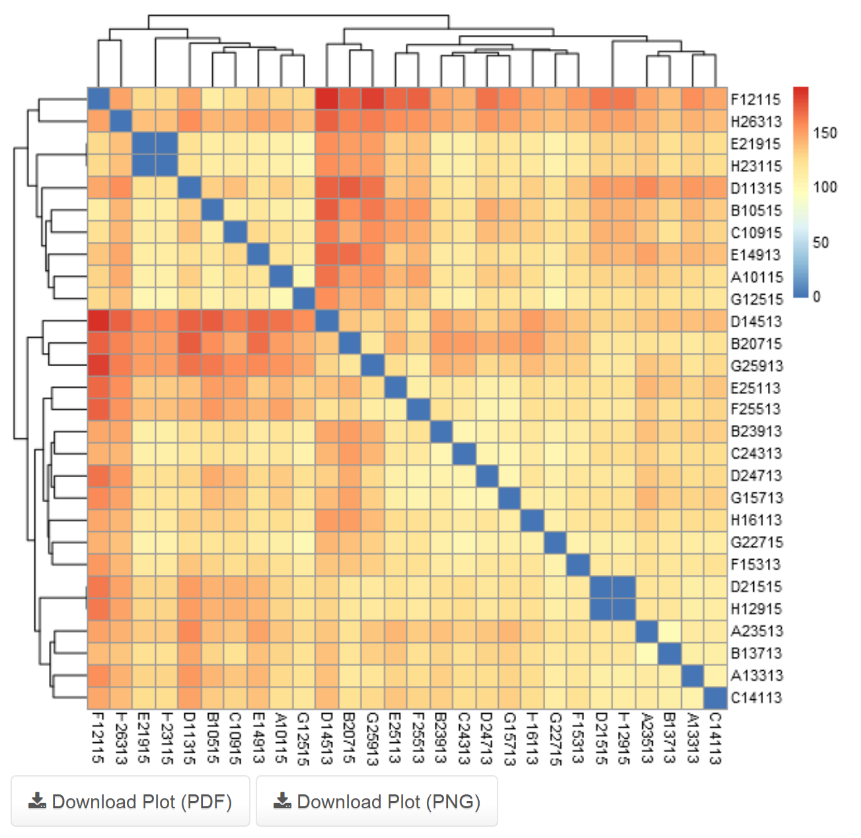  

2. “PCA” provides Principal Component Analysis for the expression estimation matrix. This analysis has the option of selecting a factor of interest. **With the example data, selecting “Rootstock” as the factor of interest provides a visualization of the first two components for each sample. In this application, PCA is a linear transformation of the gene expression levels, with the first component representing the transformed dimension with the most variability, and each subsequent component decreasing in variability. This analysis has the potential to isolate samples based on expression levels.  Here, there does not appear to be any specific rootstock that separates from the others. If there were, it could help develop directions for further analysis. The axis labels indicate the first principal component accounts for 37% of the variance between samples, whereas the second principal component accounts for 7%.**  

	  	

3. “MDS” provides multidimensional scaling, which is a similar analysis to PCA except it develops components through non-linear transformations of the gene expressions. **With the sample data, we observe similar results to that of the PCA results, with similar potential interpretations if any sample or groups of samples were to differentiate from the others.**  

	  

4. “Heatmap” provides an interactive heatmap with rows representing the gene IDs and columns representing sample IDs. This heatmap requires an ID cutoff to select the indicated number of gene IDs with the highest mean expression values for display. Selecting a cell displays a plot below showing the total read counts for that specific gene ID by the selected factor. **With the example data, the 20 most variable gene IDs are displayed. The yellow color indicates gene IDs with a higher expression level for that sample, and the darker blue color represents a low expression level for that sample. Selecting ID: rna25007 shows the read counts for that ID by rootstock factor. This shows the “OWN” rootstock seems to have a higher expression level for that ID, with the exception of one sample.**  

	  

	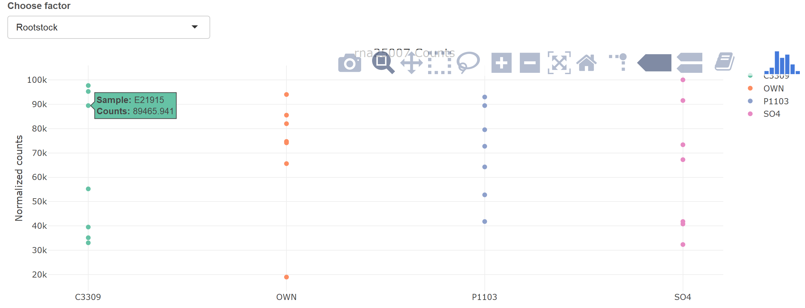  

5. “Biclustering” performs a biclustering analysis using one of the selected biclustering tools with a maximum bicluster size of the indicated cutoff value. Launching the analysis results in display of the first bicluster.  Alternative clusters can be selected from the dropdown menu and the IDs and plot for each bicluster can be downloaded using the button below the visualization. **With the sample data, the biclusters can help select the samples under which certain gene IDs are similarly expressed. Since gene expression levels can vary greatly over all samples and conditions, a biclustering approach can isolate similar expression patterns on a level where traditional clustering may miss. The first cluster for the example data shows that samples B20715, D21515, and H12915 are expressed similarly under the isolated gene IDs. Interpretations can be made similarly for each subsequent bicluster.**  

	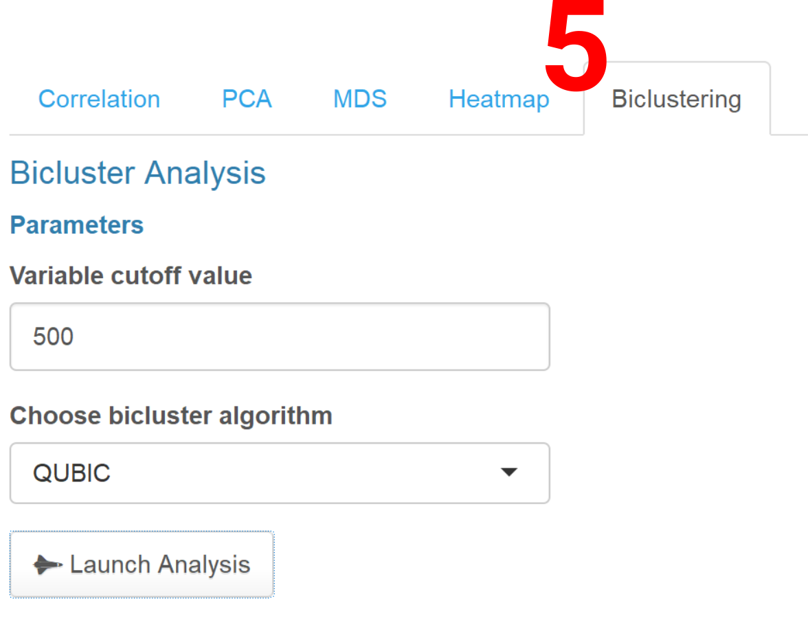  

	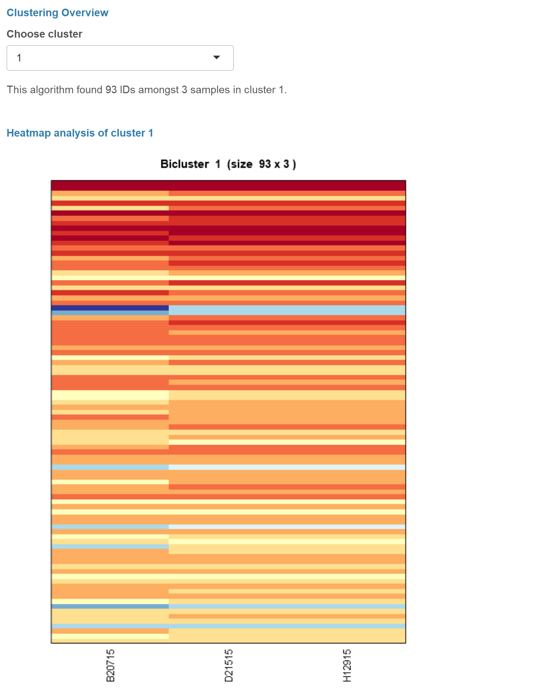  


#### DGE Analysis <a id="ia-dge-analysis"></a>
After uploading the user data or selecting the example data, users can go directly to the DGE Analysis, if they are uninterested in the previously discussed visualizations and analyses.

1. Experimental Setup allows the user to select an experimental design for their DGE analysis. Options are Two-group comparison, Multiple factor comparisons, Classical interaction design, and Additive models (paired or blocking designs). The Two-group comparison options is the traditional approach for DGE and compares two levels for the selected factor type. **With the example data, selecting “Two group comparisons” for the experimental design and “Rootstock” for the factor allows for specific pairwise comparisons of Rootstock factor levels. Here, we can select specific comparisons of interest from the permutations of all pairwise comparisons. Selecting all comparison options will provide inverse duplications, so specific selections may be needed. Below, all unique pairwise combinations are selected. The linear model is also displayed for users interested in the model used for comparisons.**  

	**NOTE:** you must choose at least one comparison for this experimental design or else an error will occur!

	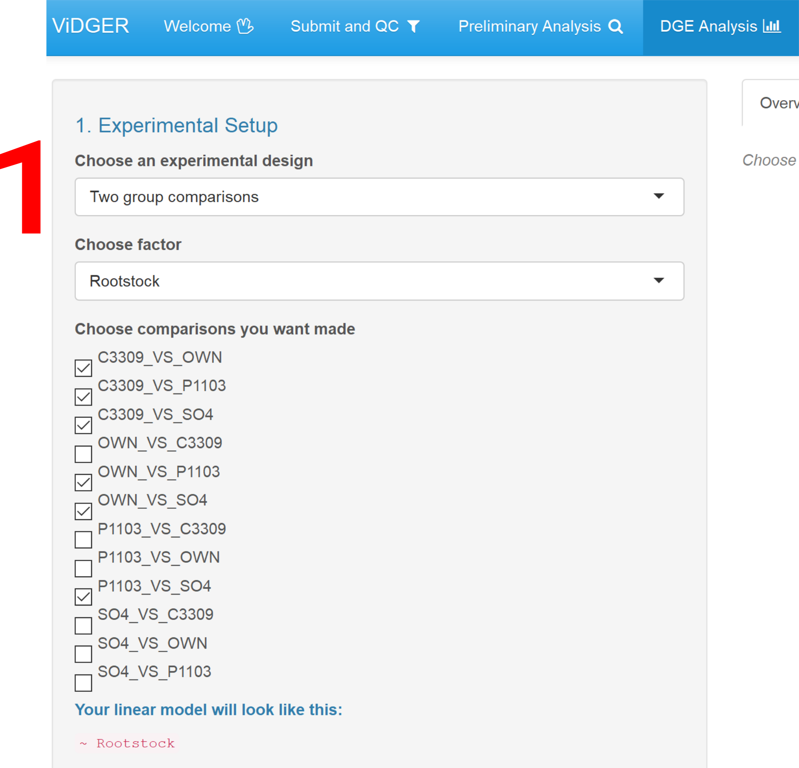  	

	The Multiple factor comparisons design has users select two factor levels and performs all crosswise comparisons for the two chosen factor levels.  **With the example data, the Multiple factor comparisons design with Rootstock and Block selected as the two factors provides optional comparisons for each rootstock separated by block. In this situation, as with the other designs, the user selects which comparisons are of interest. Selecting C3309_B_VS_C3309_E allows for a comparisons of gene expression levels for the same rootstock in two different blocks. This provides insight into the locations and possibly time (due to time requirements for sampling) for this specific rootstock.**  

	**NOTE:** you must choose at least one comparison for this experimental design or else an error will occur!

	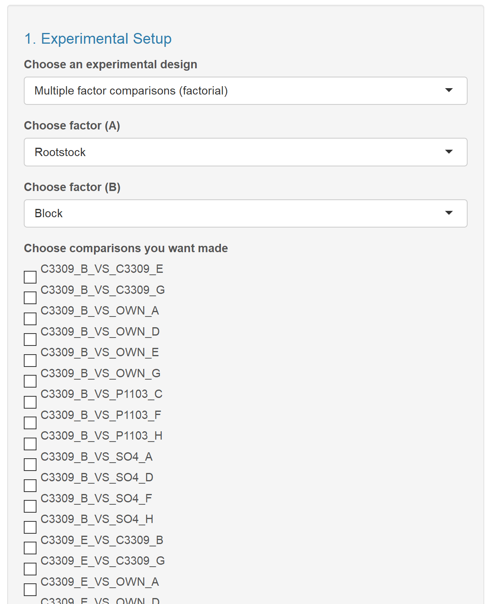  	

	The Classic interaction design allows the user to select two factor levels and one reference level for each of the selected factors. **With the experimental data, the Classic interaction design allows for selection of two factors and a reference for each. In this case, the Rootstock and Row are the chosen factors and OWN and 15 are the selected reference levels for comparison. The contrast levels selected upon submission will provide DEGs with respect to these two levels.**  

	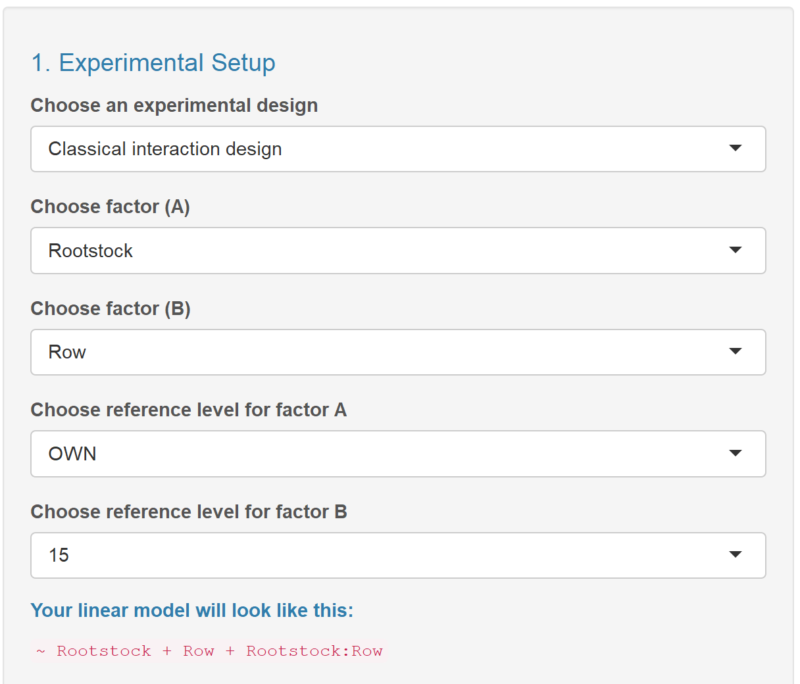  

	The Additive models design is useful when samples are paired or blocked into distinct groupings. This format requires selected factors, one for the pairing or blocking factor and the other for the treatment factor. Additionally, a reference level for each selected factor is required. **In the example data, the Block factor can be considered for grouping and the treatment factor is Rootstock. The A block and is selected as the reference level for the blocking factor and the OWN rootstock is selected for the treatment reference level.**  

	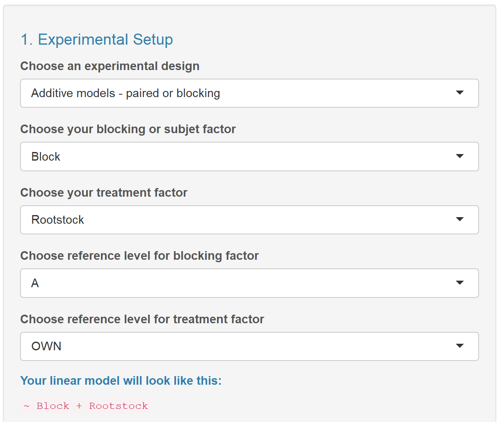

2. Following experimental design selection, the user can then select the specific tool for performing differential gene expression analysis.  Options for this purpose are DESeq2, edgeR, and limma-voom.

3. Adjusted p-value and log-fold change cutoffs can be specified to filter the results provided.  The default values are 0.05 for adjusted p-value and 1 for the minimum log-fold change.  To provide all gene comparisons, select 1 for adjusted p-value cutoff and 0 for the minimum log-fold change. 

4. Launching the analysis will perform the DGE analysis and provide results. Be mindful that this process may take more time than previous steps.  Adjusting the cutoff values after submission will automatically update the generated visualizations and results table.  

	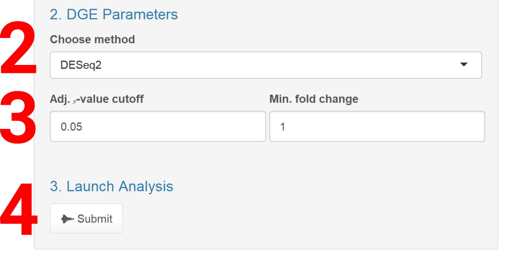

5. “Overview” displays some visualizations based on the number of DEGs, including a table of significantly up- and down-regulated gene ID counts by selected comparisons and a boxplot representing this information. **With the example data, the results show only one gene is differentially expressed in either direction from the two-group comparison based on the Rootstock factor. This information seems to follow with the previously investigated figures showing limited clustering of samples from the PCA and MDS and high correlation values between samples.**    

	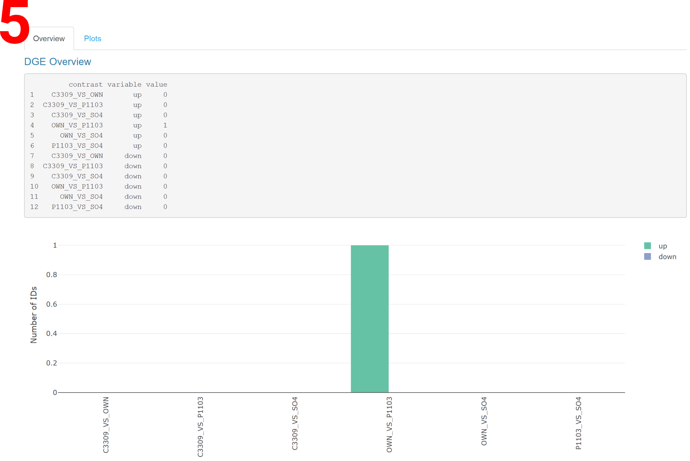  

6. “Plots” provides interactive visualizations based on the differential expression analysis as well as the actual results file from the previously-selected tool based on the selected comparison. The MA plot shows the transformed log-fold change compared to the transformed base mean for each gene ID. Specific points can be selected, highlighting both the point and the corresponding row in the results table found below the figure. Additionally, the gene ID can be selected from the results table, which will highlight the location of that gene ID on the figure.  

	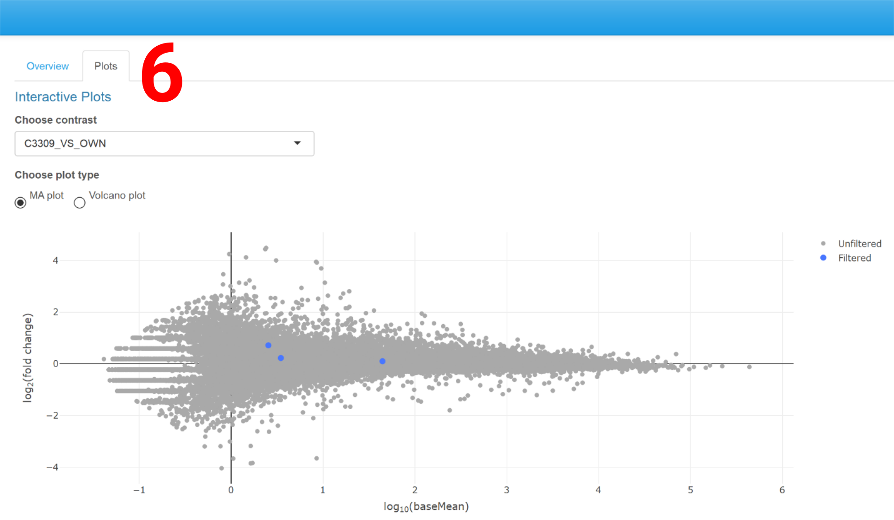  

	The Volcano plot shows a comparison of the transformed p-value compared with the transformed log-fold change. As with the MA plot, the Volcano plot is interactively connected with the results table found below the figure.  

	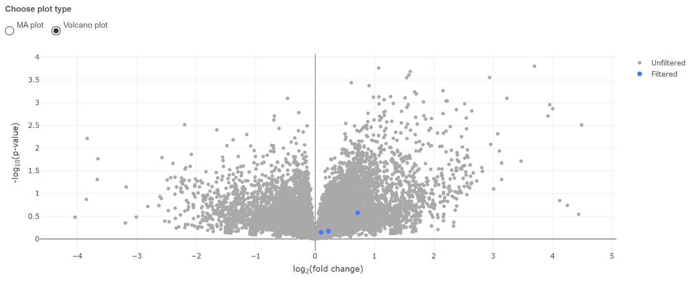  

	The results table is generated in coordination with the above plots and displays the output file of the selected tool’s differential gene expression analysis. This table can be sorted increasingly or decreasingly by any of column. The integrated search feature also allows for specific gene IDs to be found in the table. This results file can be exported in a filtered or unfiltered format. **With the example data, sorting by adjusted p-value (padj) shows that there are no differentially expressed genes for this specific comparison (C3309 vs. OWN).**  

	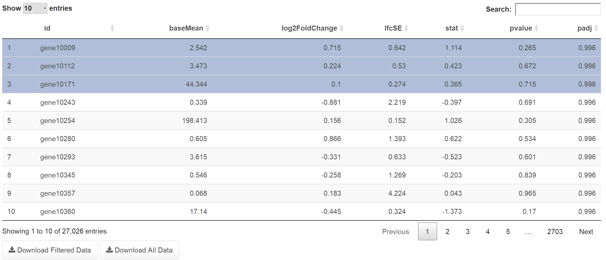 

<br>
<br>
<br>
