---
title:
    - RNA-seq data analysis and intrepretation with IRIS-DGE
author:
- name: Brandon Monier
  affiliation:
  - &id South Dakota State University
  - Department of Biology and Microbiology
- name: Adam McDermaid
  affiliation: 
  - *id
  - &id2 Bioinformatics and Mathematical Biosciences Lab
- name: Jing Zhao
  affiliation:
  - Sanford Research
- name: Qin Ma
  affiliation:
  - *id
  - *id2
date: "`r format(Sys.Date(), '%m/%d/%Y')`"
abstract: >
    Next-Generation Sequencing has made available much more large-scale genomic 
    data. Studies with RNA-sequencing (RNA-seq) data typically involve 
    generation of genetic expression profiles that can be further analyzed, 
    many times involving differential gene expression (DGE). This process 
    enables a comparison across samples of two or more factor levels. A 
    recurring issue with DGE analyses is the complicated nature of the 
    comparisons to be made, in which a variety of factor combinations, pairwise 
    comparisons, and main or blocked main effects need to be tested. Here we 
    present a tool called IRIS-DGE, which is a server-based DGE tool developed 
    using Shiny providing a straightforward, user-friendly platform for 
    performing comprehensive DGE analysis. This tool provides crucial analyses 
    that help design hypotheses and to determine key genomic features. 
    IRIS-DGE integrates the three most commonly used R-based DGE tools to 
    determine differentially expressed genes (DEGs) and includes numerous 
    methods for performing preliminary analysis on user-provided genetic 
    expression information. Additionally, this tool integrates a variety of 
    visualizations, in a highly interactive manner, for improved interpretation 
    of preliminary and DGE analyses. 
output: 
    BiocStyle::html_document:
        toc: true
        # fig_caption: false
        toc_float: true
vignette: >
    %\VignetteIndexEntry{RNA-seq data analysis and intrepretation with IRIS-DGE}
    %\VignetteEngine{knitr::rmarkdown}
    %\VignetteEncoding{UTF-8}          
---

```{r setup, include=FALSE}
knitr::opts_chunk$set(echo = TRUE)
```

# Accessibility 
IRIS-DGE can be freely accessed directly through this
[link](http://bmbl.sdstate.edu/IRIS/) or through R using the following commands:

```{r, eval=FALSE}
if (!require("shiny")) install.packages("shiny")
shiny::runGitHub("iris", "btmonier")
```

Typically, the link will provide an easier route to using IRIS-DGE. In
circumstances where internet connections will be limited (such as during
travel), loading IRIS-DGE through R while internet is still available will allow
users to utilize IRIS-DGE without an internet connection later on.

# A note about input data
IRIS-DGE requires two pieces of information for analysis. The first is an
expression estimation matrix, also referred to as a count matrix, displaying
the gene expression estimates for each sample. The format requires a CSV file
with the row names to list the gen IDs and column names to list the sample IDs.
The second required input is a condition matrix, wherein the factor levels for
each sample are provided. This file requires a CSV format and row names to be
the sample IDs matching the sample IDs from the expression estimation matrix
and the column names to be the condition factors. 

For the following tutorial, the data used for this tutorial are derived from
28 *Vitis vinifera* (grape) samples with three distinct factors
(Rootstock, row, and block). This data can viewed as the "big" example data set
found under the `Submit and QC` tab under `1. Submission Parameters`.

## Expression matrices
Typically, an expression matrix, also known as count data or a count matrix
refers to data where every $i$-th row and $j$-th column refer to how many
reads are assigned to gene (ID) $i$ in sample $j$. For example, if we have
simplified count data for 4 samples and three genes, the `R` output will look
something like this:

```
        sample1 sample2 sample3 sample4
gene001      23       3      45       2
gene002       6       7       7       8
gene003       0      34       3      42
```

**Note:** When loading count data into IRIS-DGE, make sure that the first column is
your gene IDs and that sample names are short, concise, and avoid the use of
mathematical operators (`+`, `-`, `/`, `*`, `^`, etc.) and spaces between
words. If a space is necessary for legibility, please consider using an
underscore (`_`)

## Condition matrices
Condition matrices, also known as metadata,  details the design of your
experiment. In this type of matrix, every $i$-th row and $j$-th column refer to
factor levels assigned to sample $i$ and factor $j$. For example, if were to
look at the samples given in the [count data](#count-mat) section, the metadata
`R` output will look something like this:

```
        condition time
sample1   treated   0h
sample2 untreated   0h
sample3   treated  24h
sample4 untreated  24h
```

**Note^1^:** When loading metadata into IRIS-DGE, make sure that the first column is
your sample names and that column names and treatment levels are short,
concise, and avoid the use of mathematical operators (`+`, `-`, `/`, `*`, `^`,
etc.) and spaces between words. If a space is necessary for legibility, please
consider using an underscore (`_`) 

**Note^2^:** Metadata can be expanded to fit the nature of your experiment (i.e.
multiple factors can be added). The only thing that must remain consistent
between these two matrices, is the sample information. Column names in count
data **must** be the same as row names in the metadata.


# Expedited analysis

## Overview
Expedited analysis is for users who want a quick and efficient method of
producing DGE results using the default parameters and tools in IRIS-DGE. 

## Submit and QC
1. Click on the `Submit and QC` tab:


2. Load user data by selecting `Load my own data` under 
   `1. Submission Parameters`. User data requires one count matrix and one 
   condition matrix. **Note:** you must supply both forms of data:
   


3. Click `Submit` to load the data under `3. Launch Overview`:


4. After submitting the data, proceed to the `DGE Analysis` tab at the top. 
   **Note:** if a specific experimental design other than the basic two-group 
   comparison is required, select it accordingly:
    


5. Select the factor of interest and check the boxes for the comparisons of
   interest under `3. Experimental Parameters`. **Note^1^:** you must choose at 
   least one comparison for whatever experimental design you choose under 
   `1. Experimental Setup`! **Note^2^:** If you do not want to use `DESeq2`, 
   feel free to change this method to either `edgeR` or `limma-voom` under 
   `2. DGE Paramters`. Also, feel free to change adjusted $p$-values and
   minimum fold change if these defaults do not fit your analysis:
   
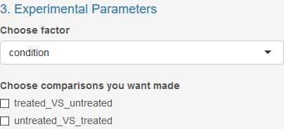

5. Submit the parameters to perform DGE analysis under `4. Launch Analysis`:


6. Select the newly formed `Plots` subtab on the main page to view the DGE 
   results table towards the bottom:
   


## Data export
1. To export results data from the `DGE Analysis` tab, click on the 
   `Download All Data` button at the bottom of the page to download the 
   results file:


# In-depth Analysis

## Overview
By choosing the in-depth analysis route, you will be given more information
about your data including:

* Count data distribution;
* Total number of reads/sample;
* Sample correlation analysis;
* Biclustering;
* Principal components and multidimensional scaling;
* Identification of most variable IDs in data.

## Submit and QC
1. Click on the `Submit and QC` tab near the top-left corner of the application: 


2. Under `1. Submission Paramters`, select either 
   `Start with a small example data set`, `Start with a big example data set`, 
   or `Load my own data` to upload user data. **Note:** User data requires one 
   count matrix and one condition matrix:
   

   
2. Under `2. Data Processing`, select a filter cutoff to simplify and 
   expedite computations by eliminating any rows that have below specified 
   expression totals. The default argument for our application is `10`:
   
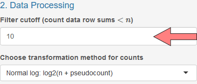

3. Right below the filter cutoff parameter, select a transformation method for
   the count data for displaying the expression estimate. **Note:** For more 
   information about any of these topics, take a look at the *FAQ* section at 
   the bottom of this document:
   


4. Click `Submit` to load the data under `3. Launch Overview`: 


5. After you click `Submit`, the main page will now be populated with several
   pieces of information in two sub-tabs, `File Summary` and `Count Summary`.
   
### File Summary
`File Summary` provides a glimpse into the submitted data. This subtab includes
three main components.

1. The `count data` section will detail the first and last five rows of the 
   count data and also include the total number of IDs and samples:
   
   

2. The second portion includes an overview of the condition data this is 
   simply an `R` console-based output of this submitted CSV file:

   

3. Finally, pre- and post-filtered gene ID counts gives a "before-and-after"
   count of the number of IDs that were filtered using the filter cutoff 
   parameter under `2. Data Processing`:

   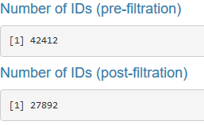
   
### Count Summary
`Count summary` provides three interactive, downloadable visualizations based
on the file for each sample.

1. Box-and-Whisker Plot for transformed read counts by sample with 
   interactivity showing the quartiles, maximum, and minimum count. *With the 
   example data, it appears that the box-and-whisker plot for each sample is 
   similar to the other samples. If one sample had a plot varying greatly 
   from the others, it would indicate some required investigation into that 
   specific sample in terms of the number of raw reads provided and proportion 
   of reads aligned.*

   
   
2. Count Data Distribution plot showing the frequency of transformed count 
   data by sample with interactivity displaying the value and frequency. 
   Additionally, double-clicking a sample ID in the legend isolates just that 
   sample's histogram. Additional sample IDs can be select for more specific 
   comparisons also. *With the example data, the histograms appear similar for 
   each sample, indicating no significant derivation. Similar to the 
   box-and-whisker plots, a single sample varying greatly from other samples 
   may indicate a required investigation into the raw read counts or read 
   alignment statistics.*
   
   
   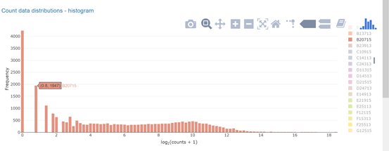

   
3. Total Reads displays a histogram of total reads by sample with 
   interactivity for displaying actual total read counts for each sample.
   Double-clicking on a sample ID in the legend isolates that sample's read 
   count histogram and allows for selecting of specific adjacent sample IDs 
   for comparison. Total reads counts for individual samples that vary 
   greatly from the other total read counts may indicate some issues with data 
   preparation (sequencing) or read alignment.  *Here, sample H26313 has a much 
   lower total reads count than the other samples. This may be reflected in 
   further comparative analyses.*
   
   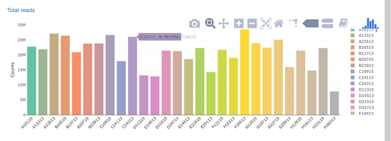
   
## Preliminary Analysis
1.  After examining your results on the `Submit and QC` tab, you may proceed to 
    the `Preliminary Analysis` tab:
   
   

2.  The `Preliminary Analysis` tab will be populated with several subtabs, 
    similar to the `Submit and QC` tab. The first subtab you will see is the 
    `Correlation` tab. This tab provides correlation analysis of the expression
    matrix by sample:
   
   
   
3.  Under the `Correlation` subtab you will see several visualizations. 
    `Interactive Correlation Analysis` displays a heatmap of the correlation 
    between samples with interactivity showing the actual correlation between 
    the two intersecting samples. *The example data shows most sample-sample 
    correlations of 0.95 or larger, indicating relatively high correlation. The
    darker cells here signify less similar samples, which may yield more 
    interesting differential expression results. This graph can indicate 
    comparisons of interest in future analyses. In most cases, the high number 
    of gene IDs with similar or identical expression estimates will cause
    correlations to be large, even for dissimilar genetic expression profiles:* 

   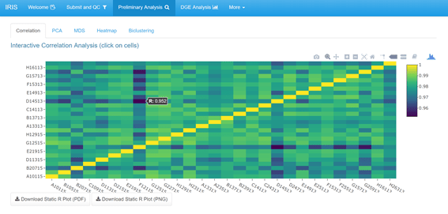

4.  Clicking on a cell will provided a scatterplot of the two intersecting 
    samples with each data point representing one gene ID. A scatterplot with 
    points falling more closely along the diagonal indicates samples with more
    similar genetic expression profiles. *This scatterplot shows a clear trend 
    of data points (gene IDs) falling along or close to the diagonal. That 
    means these two samples have very similar genetic expression profiles. Data
    points that fall far from the diagonal line represent genes with dissimilar
    expression levels between the select samples:*
   
   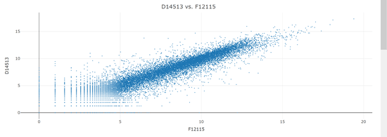
   
5.  The Sample Distance Matrix provides a heatmap of the Euclidean distance 
    between the gene expression vectors for each sample pair. The larger 
    distance (darker red color) indicates samples with the most dissimilar 
    genetic expression profiles. This matrix also includes a clustering of the 
    samples based on the vectorized expression profiles. *With the example data, 
    two distinct clusters can be observed through the first branching of the
    dendrogram. Additionally, as with the correlation heatmap, specific cells 
    with a darker color indicate a more dissimilar pair of samples based on 
    genetic expression:*
   
   

6.  The next visualization will be under the `PCA` subtab. This subtab 
    provides Principal Component Analysis (PCA) for the expression estimation 
    matrix:
    
   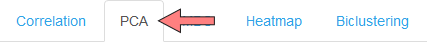
   
7.  This analysis has the option of selecting a factor of interest. *With the 
    example data, selecting "Rootstock" as the factor of interest provides a
    visualization of the first two components for each sample. In this 
    application, PCA is a linear transformation of the gene expression levels, 
    with the first component representing the transformed dimension with the 
    most variability, and each subsequent component decreasing in variability. 
    This analysis has the potential to isolate samples based on expression 
    levels. Here, there does not appear to be any specific rootstock that 
    separates from the others. If there were, it could help develop directions 
    for further analysis. The axis labels indicate the first principal 
    component accounts for 37% of the variance between samples, whereas the 
    second principal component accounts for 7%:*

   

8.  The next visualization will be under the `MDS` subtab. This subtab 
    provides multi dimensional scaling for the expression estimation matrix. 
    This is similar to PCA except is develops components through non-linear
    transformations of the gene expressions:
   
   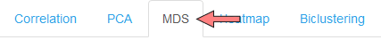
   
9.  *Looking back at our sample data, we observe similar results to that of the 
    PCA results, with similar potential interpretations if any sample or groups 
    of samples were to differentiate from the others:*

   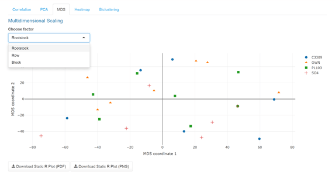

10. The next visualization will be under the `Heatmap` subtab. This subtab 
    provides an interactive heatmap with rows representing the gene IDs and 
    columns representing sample IDs:
   
   
   
11. This heatmap requires an ID cutoff to select the indicated number of gene 
    IDs with the highest mean expression values for display. Selecting a cell
    displays a plot showing the total read counts for that specific gene ID by 
    the selected factor. *With the example data, the 20 most variable gene IDs 
    are displayed. The yellow color indicates gene IDs with a higher 
    expression level for that sample, and the darker blue color represents a 
    low expression level for that sample. Selecting ID: rna25007 shows the 
    read counts for that ID by rootstock factor. This shows the "OWN" 
    rootstock seems to have a higher expression level for that ID, with the
    exception of one sample:*
    
   
   
   
12. On the next subtab (1), `Biclustering` performs a biclustering analysis 
    using one of the selected biclustering tools (3) with a maximum bicluster size 
    of the indicated cutoff value (2):

   
   
13. Launching the analysis results in display of the first bicluster. 
    Alternative clusters can be selected from the dropdown menu and the IDs 
    and plot for each bicluster can be downloaded using the button below the
    visualization. *With the sample data, the biclusters can help select the 
    samples under which certain gene IDs are similarly expressed. Since gene
    expression levels can vary greatly over all samples and conditions, a
    biclustering approach can isolate similar expression patterns on a level 
    where traditional clustering may miss. The first cluster for the example 
    data shows that samples B20715, D21515, and H12915 are expressed similarly 
    under the isolated gene IDs. Interpretations can be made similarly for 
    each subsequent bicluster:*
    
       


## DGE Analysis
1.  After uploading the user data or selecting the example data, users can go 
    directly to the `DGE Analysis` tab, preceding the `Preliminary Analysis` 
    functions:
    
   
   
2.  Once you are on this tab, you will be greeted with several options. 
    `1. Experimental Setup` will allow users to select an experimental design 
    for their DGE analysis. Options are Two-group comparison, Multiple factor
    comparisons, Classical interaction design, Additive models (paired or 
    blocking designs), Main effects, Main effects with grouping factors, or 
    Custom design:
    
   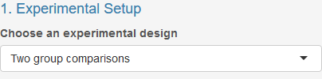    

### An overview of experimental designs
1.  The `Two-group comparisons` options is the traditional approach for DGE and 
    compares two factors levels for the selected factor type. *With the example
    data, selecting "Two group comparisons" for the experimental design and
    "Rootstock" for the factor allows for specific pairwise comparisons of 
    Rootstock factor levels. Here, we can select specific comparisons of 
    interest from the permutations of all pairwise comparisons. Selecting all
    comparison options will provide inverse duplications, so specific 
    selections may be needed. Below, all unique pairwise combinations are 
    selected. The linear model is also displayed for users interested in the 
    model used for comparisons:*
    
   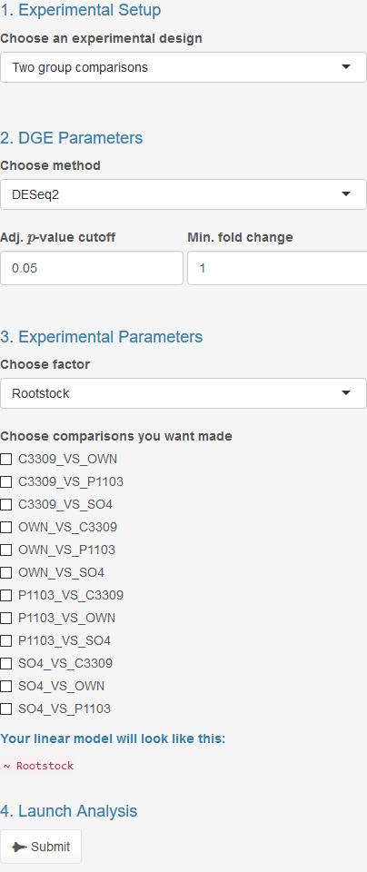    
    
2.  The `Multiple factor comparisons` design has users select two factor levels 
    and performs all crosswise comparisons for the two chosen factor levels. 
    *With the example data, the Multiple factor comparisons design with 
    Rootstock and Block selected as the two factors provides optional 
    comparisons for each rootstock separated by block. In this situation, as 
    with the other designs, the user selects which comparisons are of interest. 
    Selecting C3309_B_VS_C3309_E allows for a comparisons of gene expression 
    levels for the same rootstock in two different blocks. This provides 
    insight into the locations and possibly time (due to time requirements for
    sampling) for this specific rootstock:*
    
       
    
3.  The `Classical interaction design` allows the user to select two factor 
    levels and one reference level for each of the selected factors. *With the 
    experimental data, the Classic interaction design allows for selection of 
    two factors and a reference for each. In this case, the Rootstock and Row 
    are the chosen factors and OWN and 15 are the selected reference levels for
    comparison. The contrast levels selected upon submission will provide DEGs 
    with respect to these two levels:*

       

4.  The `Additive models` design is useful when samples are paired or blocked 
    into distinct groupings. This format requires selected factors, one for 
    the pairing or blocking factor and the other for the treatment factor.
    Additionally, a reference level for each selected factor is required. *In 
    the example data, the Rootstock factor can be considered for grouping and 
    the treatment factor is Block. OWN is selected as the reference level for 
    the blocking factor and the A15 Block is selected for the treatment 
    reference level:*
    
       

5.  `Main Effects` experimental design allows for testing the significance of a 
    factor across multiple factor levels. In this situation, any significant
    deviation from an intercept would result in a significantly differential 
    expressed gene. Using this approach is most useful when users want to test 
    the significance of a factor that has more than two levels. This design 
    requires indication of which factor to test as the main effect. 
    Additionally, users must specify a factor reference level for the lfc and 
    for corresponding visualizations. The $p$-values, adjusted $p$-values, and 
    related differentially expressed genes are not affected by the selected
    reference level. *In the example data, the Rootstock factor is selected, 
    which will test whether Rootstock has a significant impact on the genetic 
    expression across all Rootstock factor levels. Selection of the C3309 
    Rootstock factor level as a reference will provide lfc values and 
    visualizations relative to this level, while $p$-values and adjusted 
    $p$-values will be calculated with respect to the main effect of the 
    chosen factor:*
    
       

6.  `Main effects with grouping factors` design allows for a more detailed main
    effects testing to be performed. This design tests the indicated main 
    effect when the data is subset by a user-indicated factor. Requirements for 
    this design are indication of main effect to test, factor for grouping, and
    grouping factor level for which to provide results. As with the main 
    effects design, the user also specifies a main effect reference level for 
    lfc and visualizations. *In the example data, Rootstock is selected as the
    grouping factor, with C3309 selected as the grouping factor level for which 
    the results table will be based on. The Block factor is selected to test 
    the main effect, with B13 selected as the main effect reference level. This
    analysis will indicate which genes are differentially expressed when 
    account for Block only for the C3309 samples:*
    
   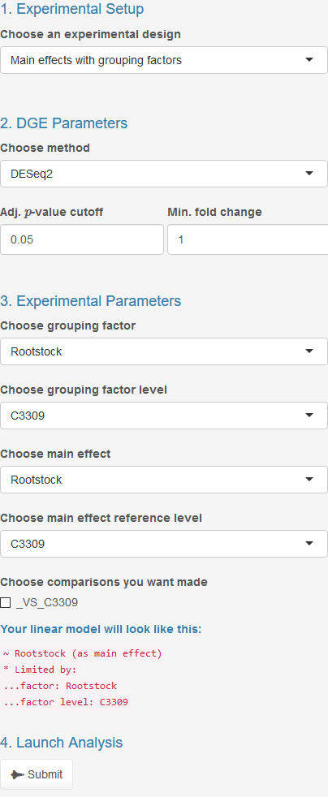    

7.  Finally, `Custom design` provides advanced users with a method for 
    indicating their own design matrix. This method is provided so that users 
    can perform more intricate DGE analyses beyond what IRIS-DGE already 
    provides as experimental design options. It is only recommended that users 
    with advanced knowledge of the modeling process to use this option, as the 
    required design matrix may not be intuitive to use appropriately:
    
       
    

### Setting up an experiment
1.  Following experimental design selection, the user can then select the 
    desired tool for performing differential gene expression analysis. This 
    will be found under `2. DGE Parameters`. Options for this purpose are 
    `DESeq2`, `edgeR`, and `limma-voom`. If the user selects one of the main 
    effects design options, the only options for DGE tools are `DESeq2` and 
    `edgeR`:
    
   

2.  Also under `2. DGE Parameters`, adjusted $p$-value and log-fold change 
    cutoffs can be specified to filter the results provided. The default values 
    are 0.05 for adjusted $p$-value and 1 for the minimum log-fold change. To
    provide all gene comparisons, select 1 for adjusted $p$-value cutoff and 0 
    for the minimum log-fold change: 

   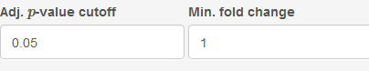

3.  Upon indication of the experimental design, DGE tool and cutoffs, the 
    parameters and comparisons for the specified analysis must be provided. 
    Such parameters can be found under `3. Experimental Parameters`. Depending 
    on the selected experimental design, the required parameters and 
    comparisons will vary:

   

4.  Launching the analysis will perform the DGE analysis and provide results. 
    This is found under `4. Launch Analysis`. **Note:** Be mindful that this 
    process may take more time than previous steps. Adjusting the cutoff 
    values after submission will automatically update the generated 
    visualizations and results table:
    
   
   
5.  If you haven't crashed your computer or our server, the main page will now
    be populated with data in the two subtabs: `Overview` and `Plots`.
    
6.  The `Overview` subtab (1) will display information based on the number of 
    differentially expressed genes (DEGs), including a table of significantly
    up- and down-regulated gene ID counts by selected comparisons (2) and an 
    interactive barplot representing this data (3). *With the example data, the 
    results show only one gene is differentially expressed in either direction
    from the two-group comparison based on the Rootstock factor. This 
    information seems to follow with the previously investigated figures 
    showing limited clustering of samples from the PCA and MDS and high
    correlation values between samples:*
    
   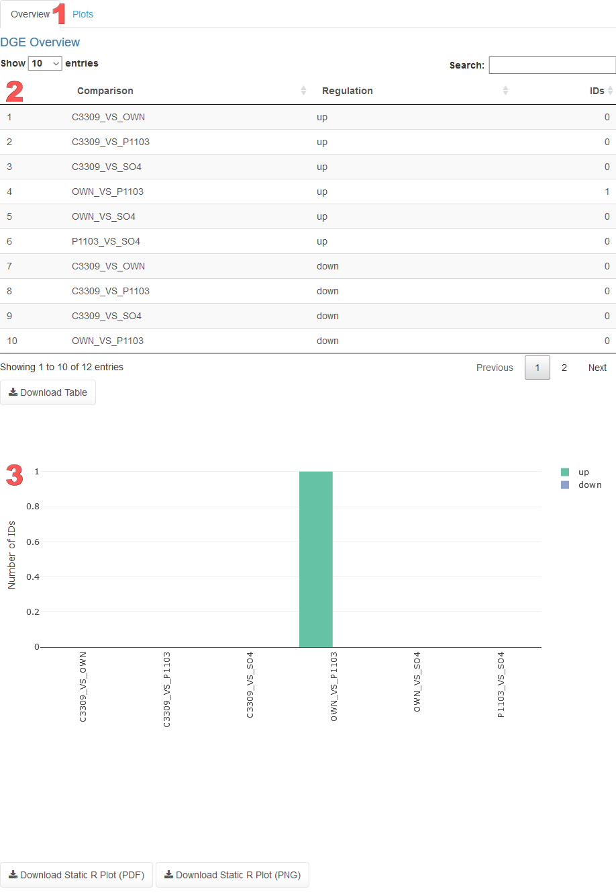
   
7.  The `Plots` subtab (1) will provides interactive visualizations based on the
    differential expression analysis as well as the actual results file from 
    the previously-selected tool based on the selected comparison. The MA plot (2)
    shows the transformed log-fold change compared to the transformed base 
    mean for each gene ID. Specific points can be selected, highlighting both 
    the point and the corresponding row in the results table found below the 
    figure. Additionally, the gene ID can be selected from the results table, 
    which will highlight the location of that gene ID on the figure:
   
  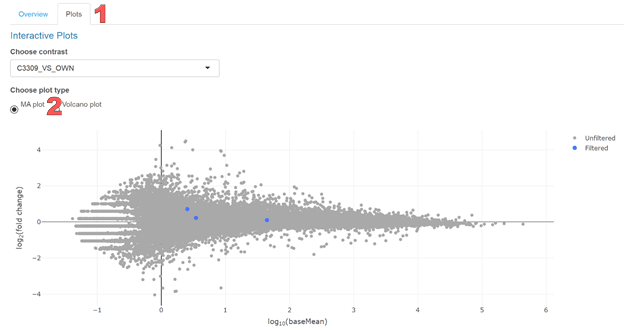
    
8.  The Volcano plot shows a comparison of the transformed $p$-value compared 
    with the transformed log-fold change. As with the MA plot, the Volcano plot 
    is interactively connected with the results table found below the figure:
    
  
  
9. Finally, the results table is generated in coordination with the above plots 
   and displays the output file of the selected tool's differential gene 
   expression analysis. This table can be sorted increasingly or decreasingly 
   by any of column. The integrated search feature also allows for specific 
   gene IDs to be found in the table. This results file can be exported in a
   filtered or unfiltered format. *With the example data, sorting by adjusted 
   $p$-value (padj) shows that there are no differentially expressed genes for 
   this specific comparison (C3309 vs. OWN):* 
    
  


# **F**requently **A**sked **Q**uestions

## Table of Contents
* [What does IRIS stand for?](#vidname)
* [What web browser(s) can I use?](#web-browser)
* [What does DEG/DGE mean?](#deg)
* [What methods does IRIS use for differential gene expression?](#dgemethods)
* [What is count data?](#count-mat)
* [What is metadata?](#metadata)
* [What do you mean by "filter cutoff"?](#filtercutoff)
* [On the 'Submit and QC' page, what are the transformation methods for counts?](#subqctran)
* [What is a correlation matrix?](#cormatrix)
* [What is a sample distance matrix?](#sampdistmatrix)
* [What is PCA?](#vis-pca)
* [What is MDS?](#vis-mds)
* [What are heatmaps?](#heatmaps)
* [What is Biclustering?](#biclustering)
* [What experimental designs does IRIS currently allow?](#expdesign)
* [What is a Adj. $p$-value cutoff?](#adjpval)
* [What is a Min. fold change value?](#minlfc)
* [What is an MA plot?](#maplot)
* [What is a volcano plot?](#volplot)
* [Where can I download a local version of the app?](#localapp)
* [References](#refs)

- - -

## What does IRIS stand for? <a id="vidname"></a>
IRIS stands for **I**nteractive **R**NA-seq analysis and **I**nterpretation using **S**hiny. This web application is based off of our prior package [ViDGER](https://github.com/btmonier/vidger) which stands for **Vi**sualization of **D**ifferential **G**ene **E**xpression using **R**

<br>

## What web browser(s) can I use? <a id="web-browser"></a>
IRIS has been properly tested on [Firefox](https://www.mozilla.org/en-US/firefox/), [Chrome](https://www.google.com/chrome/browser/desktop/index.html), and [qutebroswer](https://www.qutebrowser.org/), so we recommend using either of these browsers.

<br>

## What does DEG/DGE mean? <a id="deg"></a>
DEG and DGE simply mean **d**ifferential **e**xpression of **g**enes, and **d**ifferential **g**ene **e**xpression, respectively.

<br>

## What methods does IRIS use for differential gene expression? <a id="dgemethods"></a>
IRIS currently uses [DESeq2](https://bioconductor.org/packages/release/bioc/html/DESeq2.html), [edgeR](https://bioconductor.org/packages/release/bioc/html/edgeR.html), and [limma](http://bioconductor.org/packages/release/bioc/html/limma.html) (Love et al. 2014; McCarthy et al. 2012; Ritchie et al. 2015; Robinson et al. 2010)

<br>

## What is count data? <a id="count-mat"></a>
Count data, also referred to as an expression or count matrix refers to data where every $i$-th row and $j$-th column refer to how many reads are assigned to gene (ID) $i$ in sample $j$. For example, if we have simplified count data for 4 samples and three genes, the `R` output will look something like this:

```
        sample1 sample2 sample3 sample4
gene001      23       3      45       2
gene002       6       7       7       8
gene003       0      34       3      42
```

**Note:** When loading count data into IRIS, make sure that the first column is your gene IDs and that sample names are short, concise, and avoid the use of mathematical operators (`+`, `-`, `/`, `*`, `^`, etc.) and spaces between words. If a space is necessary for legibility, please consider using an underscore (`_`) 

<br>

## What is metadata? <a id="metadata"></a>
Metadata, also known as a condition matrix, details the design of your experiment. In this type of matrix, every $i$-th row and $j$-th column refer to factor levels assigned to sample $i$ and factor $j$. For example, if were to look at the samples given in the [count data](#count-mat) section, the metadata `R` output will look something like this:

```
        condition time
sample1   treated   0h
sample2 untreated   0h
sample3   treated  24h
sample4 untreated  24h
```

**Note^1^:** When loading metadata into IRIS, make sure that the first column is your sample names and that column names and treatment levels are short, concise, and avoid the use of mathematical operators (`+`, `-`, `/`, `*`, `^`, etc.) and spaces between words. If a space is necessary for legibility, please consider using an underscore (`_`) 

**Note^2^:** Metadata can be expanded to fit the nature of your experiment (i.e. multiple factors can be added). The only thing that must remain consistent between these two matrices, is the sample information. Column names in count data **must** be the same as row names in the metadata.

<br>

## What do you mean by "filter cutoff"? <a id="filtercutoff"></a>
A "filter cutoff" is a numerical parameter ($n$) will be implemented in your count data which will be used to remove any genes or ID rows that are $< n$. The default parameter is set to $10$, but this can be changed to any integer $>$ $0$. If you wish to avoid this step, simply set the filter cutoff to $0$.

<br>

## On the 'Submit and QC' page, what are the transformation methods for counts? <a id="subqctran"></a>
IRIS can transform count using the transformation functions from the [DESeq2](https://bioconductor.org/packages/release/bioc/html/DESeq2.html) package (Love et al. 2014). Currently there are four options:

* **Normal log: log2(n + pseudocount)**  
  The most common transformation technique is the logarithm, defined as "Normal log" in the parameters. This is implemented using the following formula:  
  $$y = log_{2}(n + p)$$
  Where $n$ is the read counts and $p$ is a "pseudocount" due to some gene ID read counts being $0$.

* **Regularized log: rlog(n)**  
	Genes that posses high levels of raw counts will give similar results to  normalization techniques, however, for genes that have lower levels of counts, the overall values are reduced to fit more to the average values produced by genes across entire samples in an experimental setup. The overall process is defined by the following formula:  
	$$log_{2}(q_{ij}) = \beta_{i0} + \beta_{ij}$$
	Where $q_{ij}$ is relative to the expected value of counts for gene $i$ and sample $j$, $\beta_{i0}$ is the intercept, $\beta_{ij}$ is the shrunken effect for each sample based on a dispersion-mean trend used on the count data.

	**Note:** the `rlog()` function is rather time consuming, so be prepared to wait a while depending on the size of your experiment.

* **Variance stabilizing transform: vst(n)**     
	Variance stabilizing transformation (VST) is calculated from the fitted dispersion-mean relations and then transforms the normalized count data which produces homoskedastic data. The overall goal in using VST is to produce constant variance that is relative to the mean (Tibshirani 1988).

* **No transformation**  
	If you choose this option, no transformation will applied to your count data.

These transformation options are not directly applied to the data used in the "DGE Analysis" tab. These are used for visualization and biclustering purposes in the "Preliminary Analysis" tab and count summary visualizations.

<br>

## What is a correlation matrix? <a id="cormatrix"></a>
A correlation matrix is used to generate the correlation coefficients between all relationships amongst the samples in your data. To visualize this data, a heatmap is used. The intense the yellow color is in the matrix refers to a higher positive correlation between two samples while the more blue refers to lower coefficients.

**Note:** This matrix utilizes the Plotly API library for R, so it is interactive. Click on the cells of the matrix to generate an interactive scatterplot for the two relative samples.

<br>

## What is a sample distance matrix? <a id="sampdistmatrix"></a>
Sample correlation matrices are used to determine Euclidean distances between the gene expression vectors for each sample pair. To visualize these relationships, a heatmap is used. The more blue a cell is indicates that the sample pairs overall gene expression is the same. The more intense the red color becomes indicates that gene expression is widely different. Additionally, sample distances are clustered to show additional groupings amongst samples.

<br>

## What is PCA? <a id="vis-pca"></a>
PCA stands for **P**rincipal **C**omponent **A**nalysis. This statistical technique is used to reduce complex datasets of multiple variables of gene expression to fewer dimensions (plotted on $x$, $y$, or $z$ axes). Generally, for RNA-seq data, it is used to see clustering or grouping amongst sample and their respective treatments. For example, if you have a "treated" and "untreated" conditional levels, you would generally expect samples from each of the levels to group closer together.

<br>

## What is MDS? <a id="vis-mds"></a>
Similar to PCA, **m**ultiple-**d**imensional **s**caling (MDS) is another grouping technique for samples. Unlike PCA, MDS produces components through non-linear methods for gene expression.

<br>

## What are heatmaps? <a id="heatmaps"></a>
Heatmaps, specifically under the "Heatmap" tab under "Preliminary Analysis" are used to visualize the gene IDs that have the highest overall mean (i.e. row means in the count data) amongst the samples in a RNA-seq experiment. The more intense the yellow color indicates higher transformed counts (see the "[On the 'Submit and QC' page, what are the transformation methods for counts?](#subqctran)" question for further information). Since count data matrices can become incredibly large in size, showing the entire data set would too "noisy". As a result, we have set an ID cutoff parameter to show the $20$ most expressed IDs for display. This parameter can be changed to any integer $> 0$. 

Since this interactive, you can hover over cells for additional information and click on cells to generate an interactive dot plot which will display total read counts for that specific gene ID by the selected factor.

<br>

## What is biclustering? <a id="biclustering"></a>
Biclustering is a clustering technique which allows for clustering of both gene IDs and samples in a count data matrix. Biclustering in IRIS performs a biclustering analysis using one of the selected biclustering tools with a maximum bicluster size of the indicated cutoff value. 

<br>

## What experimental designs does IRIS currently allow? <a id="expdesign"></a>
One of the motivations when designing IRIS was to allow for a variety of commonly used experimental designs employed in RNA-seq experiments. Currently, our application allows for:

* Comparisons between two factor levels (groups) amongst one treatment factor; 
* Comparisons between level combinations between two treatment factors; 
* Classical interaction designs between two treatment factors; 
* Accountability for additive models (blocking and paired effects);
* Main effects;
* Main effects with grouping factors;
* Custom designs with user generated model matrices (advanced!)

For more information about each of these setups, have a look at section `4.4.1`.

<br>

## What is a Adj. $p$-value cutoff? <a id="adjpval"></a>
The adjusted (adj.) $p$-value cutoff is a numerical parameter to filter gene IDs that are not significantly expressed between two conditions. Any adjusted $p$-value that is $< n$, where $n$ is the cutoff parameter, will be removed from the filtered data and visualizations in conjunction with the [minimum $log_{2}$ fold change](#minlfc).

<br>

## What is a Min. fold change value? <a id="minlfc"></a>
The minimum (Min.) fold change is a numerical parameter to filter gene IDs that have a $log_{2}$ fold change that is $< n$, where $n$ is the cutoff parameter. Any gene ID that is below the parameter will be removed from the filtered data and visualizations in conjunction with the [adjusted $p$-value](#adjpval).

<br>

## What is an MA plot? <a id="maplot"></a>
An MA plot is a method to visualize gene expression data between two conditions. A scatter plot is produced by plotting the $log_{2}$ fold change (**M**) compared to the transformed base mean ($log_{10}$) (**A**) on the $x$ axis.

<br>

## What is a volcano plot? <a id="volplot"></a>
A volcano plot is another method to visualize gene expression data between two conditions. In this plot, the transformed $p$-values ($-log_{10}$) is compared to the $log_{2}$ fold change. Volcano plots can be used for rapid identification of statistically significant genes in terms of there $p$-value and $log_{2}$ fold change. Significant values will generally be located in the upper right- and left-handed corners of the graph. 

<br>

## Where can I download a local version of the app? <a id="localapp"></a>

**GitHub**

You can download the latest (*and experimental*) version of the web application using this script in an up-to-date version of `R`:

```{r, eval=FALSE}
if (!require("shiny")) install.packages("shiny")
shiny::runGitHub("iris", "btmonier")
```

<br>

# References <a id="refs"></a>
Love, Michael I., Wolfgang Huber, and Simon Anders. 2014. "Moderated estimation of fold change and dispersion for RNA-seq data with DESeq2." Genome Biology 15 (12): 550.

McCarthy, J. D, Chen, Yunshun, Smyth and K. G (2012). "Differential expression analysis of multifactor RNA-Seq experiments with respect to biological variation." Nucleic Acids Research, 40(10), pp. 4288-4297.

Tibshirani, Robert. 1988. "Estimating Transformations for Regression via Additivity and Variance Stabilization." Journal of the American Statistical Association 83: 394-405.

Ritchie ME, Phipson B, Wu D, Hu Y, Law CW, Shi W and Smyth GK (2015). "limma powers differential expression analyses for RNA-sequencing and microarray studies." Nucleic Acids Research, 43(7), pp. e47.

Robinson MD, McCarthy DJ and Smyth GK (2010). "edgeR: a Bioconductor package for differential expression analysis of digital gene expression data." Bioinformatics, 26(1), pp. 139-140.
