```{r setup, include=FALSE}
knitr::opts_chunk$set(
  echo = TRUE,
  fig.pos="H"
)
```

# S1: Citation information

**Table 1:** A comparative overview of citation counts for DGE tools and DGE 
servers. DGE analytical tools (*Tool*) are compared based on the 
following criteria: Current number of citations (*Citations*), percentage of 
total citations from the analytical tools presented (*Citation %*), year
the analytical tool was published (*Year*), approximate citations per year
based on data accrued through 2017 (*Citations/Year*), and if the analytical
tool has an R-based application (*R-based*).

| Tool                             | Citations | Citation %  | Year | Citations/Year (through 2017) | R-based? |
|----------------------------------|-----------|-------------|------|-------------------------------|----------|
| edgeR (Robinson et al. 2010)     | 7093      | 32.39700375 | 2010 | 1013.285714                   | Yes      |
| Cuffdiff (Trapnell et al. 2012)  | 4533      | 20.70430255 | 2012 | 906.6                         | No       |
| Cuffdiff2 (Trapnell et al. 2013) | 1508      | 6.887731799 | 2013 | 377                           | No       |
| DESeq2 (Love et al. 2014)        | 4249      | 19.40714351 | 2014 | 1416.333333                   | Yes      |
| limma (Ritchie et al. 2015)      | 2399      | 10.95733991 | 2015 | 1199.5                        | Yes      |
| DEGseq (Wang et al. 2009)        | 1237      | 5.649949758 | 2009 | 154.625                       | Yes      |
| baySeq (Hardcastle et al. 2010)  | 562       | 2.56691331  | 2010 | 80.28571429                   | Yes      |
| SAMseq (Li et al. 2013)          | 275       | 1.256051886 | 2013 | 68.75                         | Yes      |
| NOIseq (Tarazona et al. 2012)    | 38        | 0.173563533 | 2012 | 7.6                           | Yes      |

# S2: Accessibility 
IRIS-EDA can be freely accessed directly through this
[link](https://bmbls.bmi.osumc.edu/IRIS/) or through R using the following code
in the proceeding sections.

## S2.1: Install CRAN packages
IRIS-EDA requires several packages to operate. To get these pacakages, the
following commands can be entereed into an R terminal to check if you
already have the necessary packages. If not, the following code will install
any missing packages:

```{r, eval=FALSE}
# CRAN
packages <- c(
    "crosstalk", "dplyr", "DT", "gtools", "plotly", "shiny", "plyr",
    "shinyBS", "shinycssloaders", "shinythemes", "tibble", "tidyr",
    "Rcpp", "Hmisc", "ggplot2", "locfit", "GGally", "pheatmap", 
    "reshape2", "backports", "digest", "fields", "psych", "stringr", 
    "tools", "openxlsx", "Rtsne", "WGCNA", "flashClust", "paraellel",
    "MCL", "kmed", "ape"
)
np <- packages[!(packages %in% installed.packages()[, "Package"])]
if(length(np)) install.packages(np)
```

## S2.2: Install Bioconductor packages
You will also need several Bioconductor packages. Similar to the prior section,
the following code will check and install any missing Bioconductor packages 
into your R library:

```{r, eval=FALSE}
# Bioconductor
bioc.packages <- c("DESeq2", "edgeR", "limma", "QUBIC")
np <- bioc.packages[!(bioc.packages %in% installed.packages()[,"Package"])]
source("https://bioconductor.org/biocLite.R")
if (length(np)) biocLite(np)
```

## S2.3: Run the Shiny application
Once you have installed all of the necessary packages, you can now run the 
application locally by entering the following code into an R terminal:

```{r, eval=FALSE}
shiny::runGitHub("iris", "btmonier")
```

Typically, the link will provide an easier route to using IRIS-EDA. In
circumstances where internet connections will be limited (such as during
travel), loading IRIS-EDA through R while internet is still available will 
allow users to utilize IRIS-EDA without an internet connection later on. 

Installing the local application via 
[GitHub](https://github.com/btmonier/iris) will also let the user have 
access to more "developmental" versions of IRIS-EDA. Be warned though; 
using developmental versions of this application may be "cutting edge", 
however, this could potentially break various features in the application. 
Therefore, using the server (<https://bmbls.bmi.osumc.edu/IRIS/>) will provide a 
more "stable", peer-reviewed release of the application.

# S3: Single-cell RNA-seq

## S3.1: Overview
Upon sample submission to IRIS-EDA, you have two options: 
(1) Perform analyses on a normal RNA-seq experiment or 
(2) run single-cell RNA-seq analysis. 

If you choose the latter option, you will need to provide a file 
containing ID lengths to help reduce variability. This is crucial since
filtration of low TPM (transcripts per million) reads can lead to better 
results. In order to calculate TPM, ID length approximations are needed
in conjunction with raw count data. To submit this information to IRIS-EDA, 
**you will need to provide ID data that follows the proceeding criteria**:

```
id        id_len_kbp
gene001          1.4
gene002          5.6
gene003          0.8
...              ...
```

**Note**:
This file must be in a comma seperated value (CSV) format, where column 1
is the ID (e.g. gene, transcript, etc.) and column 2 is the approximation
of length in **kilobase pairs**.


## S3.2: A method to obtain this data
There are many ways to obtain these values. A common procedure would be to
parse the respective general fearture format version 3 (GFF3) file and 
determine the length through calculating the difference between the 
start and end locations. 

If you need help parsing this information, a primitive `R` function has been
made, which you can find 
[here](https://gist.github.com/btmonier/409856fe22280603ca19345fdd4e5e22).
To run this function, you will need to install and load 
3 packages into your R library:

  * `ape`
  * `stringr`
  * `dplyr`

All of these packages can be found on the 
[CRAN repository](https://cran.r-project.org/), or by using the
`install.packages()` function provided in the base package of `R`. 

This function has four parameters:

  * `gff`: the location to the GFF3 file on your computer

  * `cts`: your raw count matrix that you will provide to IRIS-EDA. **Note**:
    this object must be a `matrix` type and have the same format that is
    found in the first section of this walkthrough (*A note about input data*).

  * `type`: the GFF3 type column identifier (e.g. gene, transcript, exon,
    CDS, etc.)

  * `attribute`: the GFF3 attribute (e.g. `ID`, `gene_id`, 
    `transcript_id`, `gene_name`, or `transcript_name`)

Depending on the size of this file, this may take some time. This function
will return a `tibble` data frame, so make sure you assign it to an object
before you use `write.csv()`. After you perform this task, the file can
successfully be submitted to IRIS-EDA. 


## S3.3: TPM filtration
Once you have submitted the data, you will notice that the `Filter cutoff`
changes from `count data row sums` to `TPM`:


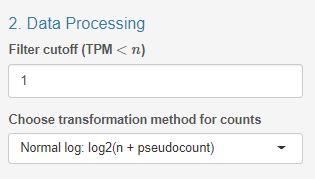\


The default is set to a value of `1`, however, this can be changed at the
user's discretion. 

**Note (1)**: this value corresponds to which rowsums
(i.e. ID sums) will be filtered out if they have a value that is less than
the user parameter.

**Note (2)**: “For users with 10X scRNA-Seq data or other data type with
expected low expression across all genes, we have a submission option that
changes default parameterizations to account for this. If submitting 10X
scRNA data, please use the `scRNA - 10X Genomics` option.

# S4: A note about input data
IRIS-EDA requires two pieces of information for analysis. The first is an
expression estimation matrix, also referred to as a count matrix, displaying
the gene expression estimates for each sample. The format requires a CSV file
with the row names to list the gen IDs and column names to list the sample IDs.
The second required input is a condition matrix, wherein the factor levels for
each sample are provided. This file requires a CSV format and row names to be
the sample IDs matching the sample IDs from the expression estimation matrix
and the column names to be the condition factors. 

The data used for this tutorial are derived from 28 *Vitis vinifera* (grape) 
samples with three distinct factors (Rootstock, row, and block). This data can 
viewed as the "big" example data set found under the `Submit and QC` tab under 
`1. Submission Parameters`.

## S4.1: Expression matrices
Typically, an expression matrix, also known as count data or a count matrix
refers to data where every $i$-th row and $j$-th column refer to how many
reads are assigned to gene (ID) $i$ in sample $j$. For example, if we have
simplified count data for 4 samples and three genes, the `R` output will look
something like this:

```
        sample1 sample2 sample3 sample4
gene001      23       3      45       2
gene002       6       7       7       8
gene003       0      34       3      42
```

**Note^1^:** When loading count data into IRIS-EDA, make sure that the 
first column is
your gene IDs and that sample names are short, concise, and avoid the use of
mathematical operators (`+`, `-`, `/`, `*`, `^`, etc.) and spaces between
words. If a space is necessary for legibility, please consider using an
underscore (`_`)

**Note^2^:** For sample names, **avoid starting any entries with numerical
elements** (e.g. `1sample`, `2_human`, `42_amf`, etc.). This may potentially 
cause unexpected errors in downstream analyses!

## S4.2: Condition matrices
Condition matrices, also known as metadata,  details the design of your
experiment. In this type of matrix, every $i$-th row and $j$-th column refer to
factor levels assigned to sample $i$ and factor $j$. For example, if were to
look at the samples given in the [count data](#count-mat) section, the metadata
`R` output will look something like this:

```
        condition time
sample1   treated   0h
sample2 untreated   0h
sample3   treated  24h
sample4 untreated  24h
```

**Note^1^:** When loading metadata into IRIS-EDA, make sure that the first column is
your sample names and that column names and treatment levels are short,
concise, and avoid the use of mathematical operators (`+`, `-`, `/`, `*`, `^`,
etc.) and spaces between words. If a space is necessary for legibility, please
consider using an underscore (`_`).

**Note^2^:** For this data, **avoid starting any entries with numerical
elements** (e.g. 1, 2, 42, etc.). This may potentially cause unexpected 
errors in downstream analyses!

**Note^3^:** Metadata can be expanded to fit the nature of your experiment (i.e.
multiple factors can be added). The only thing that must remain consistent
between these two matrices, is the sample information. Column names in count
data **must** be the same as row names in the metadata.


# S5: Quality Control
1. Click on the `Submit and QC` tab near the top-left corner of the application: 

\

2. Under `1. Submission Paramters`, select either 
   `Start with a small example data set`, `Start with a big example data set`, 
   or `Load my own data` to upload user data. **Note:** User data requires one 
   count matrix and one condition matrix:
   
\
   
2. Under `2. Data Processing`, select a filter cutoff to simplify and 
   expedite computations by eliminating any rows that have below specified 
   expression totals. The default argument for our application is `10`:
   
\

3. Right below the filter cutoff parameter, select a transformation method for
   the count data for displaying the expression estimate. **Note:** For more 
   information about any of these topics, take a look at the *FAQ* section at 
   the bottom of this document:
   
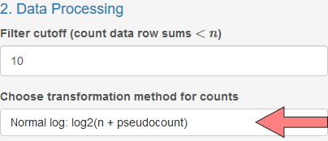\

4. Click `Submit` to load the data under `3. Launch Overview`: 

\

5. After you click `Submit`, the main page will now be populated with several
   pieces of information in two sub-tabs, `File Summary` and `Count Summary`.
   
## S5.1: File Summary
`File Summary` provides a glimpse into the submitted data. This subtab includes
three main components.

1. The `count data` section will detail the first and last five rows of the 
   count data and also include the total number of IDs and samples:
   
   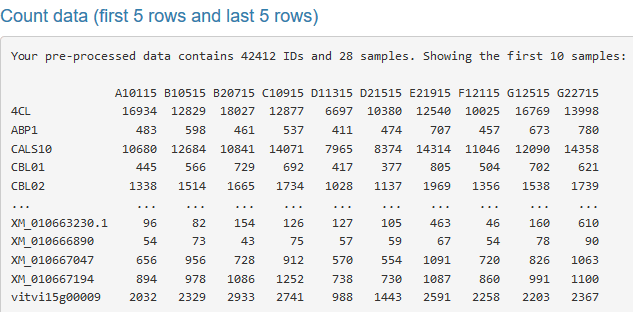\

2. The second portion includes an overview of the condition data this is 
   simply an `R` console-based output of this submitted CSV file:

   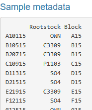\

3. Finally, pre- and post-filtered gene ID counts gives a "before-and-after"
   count of the number of IDs that were filtered using the filter cutoff 
   parameter under `2. Data Processing`:

   \
   
## S5.2: Count Summary
`Count summary` provides three interactive, downloadable visualizations based
on the file for each sample.

1. Box-and-Whisker Plot for transformed read counts by sample with 
   interactivity showing the quartiles, maximum, and minimum count. *With the 
   example data, it appears that the box-and-whisker plot for each sample is 
   similar to the other samples. If one sample had a plot varying greatly 
   from the others, it would indicate some required investigation into that 
   specific sample in terms of the number of raw reads provided and proportion 
   of reads aligned.*

   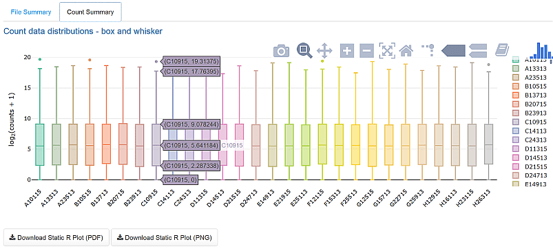\
   
2. Count Data Distribution plot showing the frequency of transformed count 
   data by sample with interactivity displaying the value and frequency. 
   Additionally, double-clicking a sample ID in the legend isolates just that 
   sample's histogram. Additional sample IDs can be select for more specific 
   comparisons also. *With the example data, the histograms appear similar for 
   each sample, indicating no significant derivation. Similar to the 
   box-and-whisker plots, a single sample varying greatly from other samples 
   may indicate a required investigation into the raw read counts or read 
   alignment statistics.*
   
   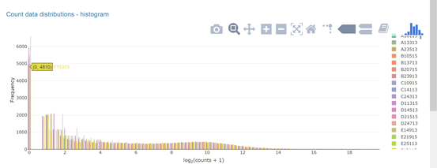\
   \

   
3. Total Reads displays a histogram of total reads by sample with 
   interactivity for displaying actual total read counts for each sample.
   Double-clicking on a sample ID in the legend isolates that sample's read 
   count histogram and allows for selecting of specific adjacent sample IDs 
   for comparison. Total reads counts for individual samples that vary 
   greatly from the other total read counts may indicate some issues with data 
   preparation (sequencing) or read alignment.  *Here, sample H26313 has a much 
   lower total reads count than the other samples. This may be reflected in 
   further comparative analyses.*
   
   \


# S6: Discovery-Driven Analyses

1.  After examining your results on the `Submit and QC` tab, you may proceed to 
    the `Discovery-Driven Analyses` tab:
   
   \

2.  The `Discovery-Driven Analyses` tab will be populated with several subtabs, 
    similar to the `Submit and QC` tab. The first subtab you will see is the 
    `Correlation` tab. This tab provides correlation analysis of the expression
    matrix by sample:
   
   \
   
3.  Under the `Correlation` subtab you will see several visualizations. 
    `Interactive Correlation Analysis` displays a heatmap of the correlation 
    between samples with interactivity showing the actual correlation between 
    the two intersecting samples. *The example data shows most sample-sample 
    correlations of 0.95 or larger, indicating relatively high correlation. The
    darker cells here signify less similar samples, which may yield more 
    interesting differential expression results. This graph can indicate 
    comparisons of interest in future analyses. In most cases, the high number 
    of gene IDs with similar or identical expression estimates will cause
    correlations to be large, even for dissimilar genetic expression profiles:* 

   \

4.  Clicking on a cell will provided a scatterplot of the two intersecting 
    samples with each data point representing one gene ID. A scatterplot with 
    points falling more closely along the diagonal indicates samples with more
    similar genetic expression profiles. *This scatterplot shows a clear trend 
    of data points (gene IDs) falling along or close to the diagonal. That 
    means these two samples have very similar genetic expression profiles. Data
    points that fall far from the diagonal line represent genes with dissimilar
    expression levels between the select samples:*
   
   \
   
5.  The Sample Distance Matrix provides a heatmap of the Euclidean distance 
    between the gene expression vectors for each sample pair. The larger 
    distance (darker red color) indicates samples with the most dissimilar 
    genetic expression profiles. This matrix also includes a clustering of the 
    samples based on the vectorized expression profiles. *With the example data, 
    two distinct clusters can be observed through the first branching of the
    dendrogram. Additionally, as with the correlation heatmap, specific cells 
    with a darker color indicate a more dissimilar pair of samples based on 
    genetic expression:*
   
   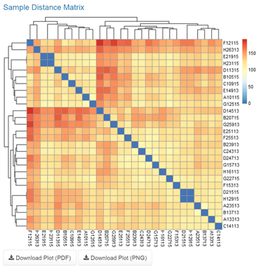\

6.  The next visualization will be under the `PCA` subtab. This subtab 
    provides Principal Component Analysis (PCA) for the expression estimation 
    matrix:
    
   \
   
7.  This analysis has the option of selecting a factor of interest. *With the 
    example data, selecting "Rootstock" as the factor of interest provides a
    visualization of the first two components for each sample. In this 
    application, PCA is a linear transformation of the gene expression levels, 
    with the first component representing the transformed dimension with the 
    most variability, and each subsequent component decreasing in variability. 
    This analysis has the potential to isolate samples based on expression 
    levels. Here, there does not appear to be any specific rootstock that 
    separates from the others. If there were, it could help develop directions 
    for further analysis. The axis labels indicate the first principal 
    component accounts for 37% of the variance between samples, whereas the 
    second principal component accounts for 7%:*

   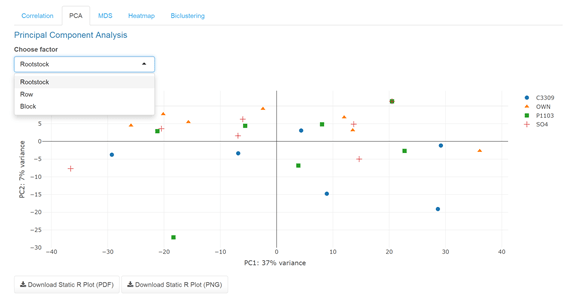\

8.  The next visualization will be under the `MDS` subtab. This subtab 
    provides multi dimensional scaling for the expression estimation matrix. 
    This is similar to PCA except is develops components through non-linear
    transformations of the gene expressions:
   
   \
   
9.  *Looking back at our sample data, we observe similar results to that of the 
    PCA results, with similar potential interpretations if any sample or groups 
    of samples were to differentiate from the others:*

   \
   
10. t-SNE allows for visualization of results in two and three dimensions.
    The three-dimensional figure is also interactive, allowing users to move
    the axes to gain a better understanding of the three-dimensional layout of
    the sample points.

   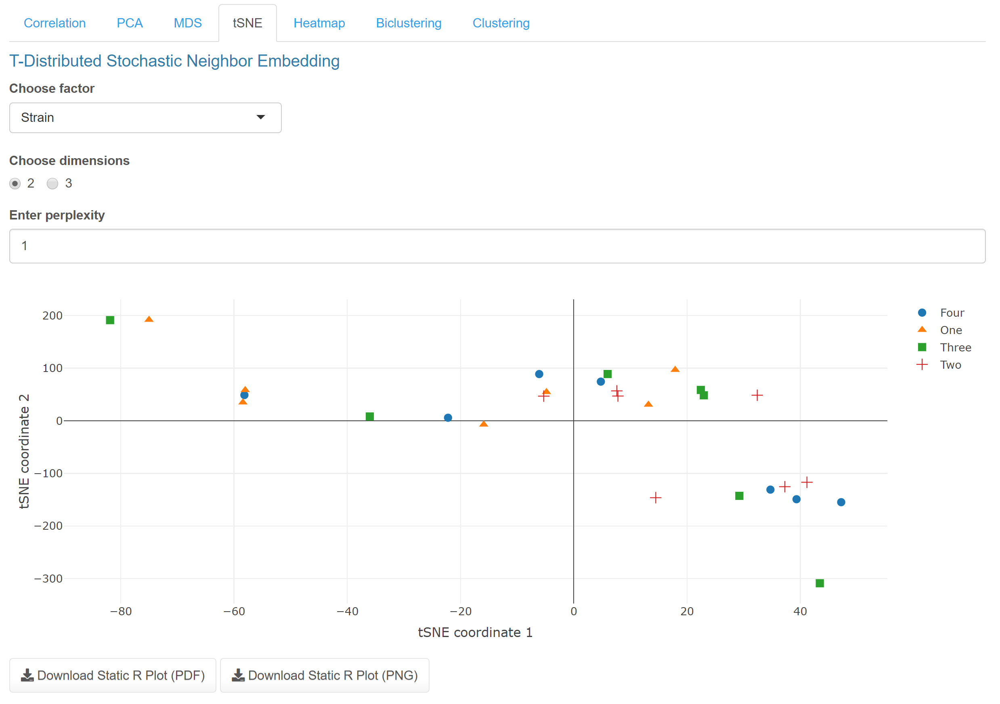\

   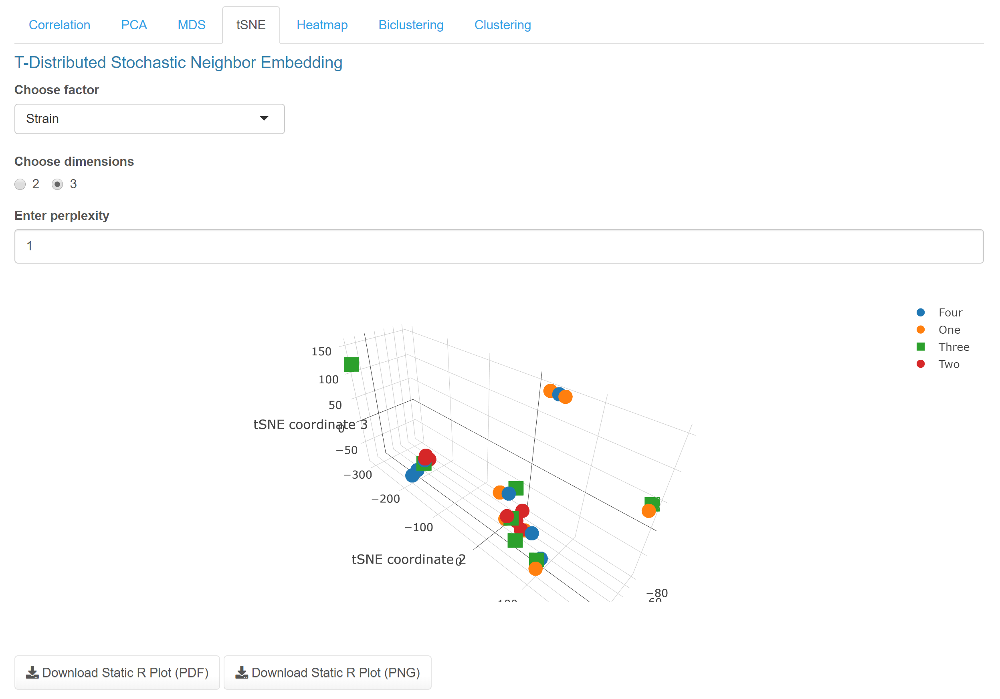\

11. The next visualization will be under the `Heatmap` subtab. This subtab 
    provides an interactive heatmap with rows representing the gene IDs and 
    columns representing sample IDs:
   
   \
   
12. This heatmap requires an ID cutoff to select the indicated number of gene 
    IDs with the highest mean expression values for display. Selecting a cell
    displays a plot showing the total read counts for that specific gene ID by 
    the selected factor. *With the example data, the 20 most variable gene IDs 
    are displayed. The yellow color indicates gene IDs with a higher 
    expression level for that sample, and the darker blue color represents a 
    low expression level for that sample. Selecting ID: rna25007 shows the 
    read counts for that ID by rootstock factor. This shows the "OWN" 
    rootstock seems to have a higher expression level for that ID, with the
    exception of one sample:*
    
   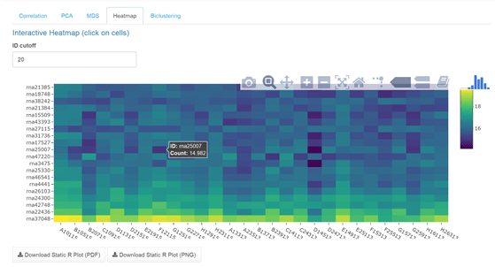\
   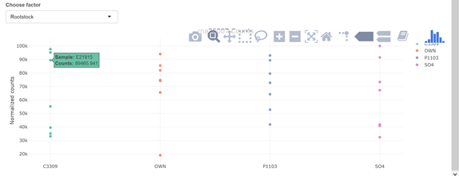\
   
13. On the next subtab (1), `Biclustering` performs a biclustering analysis 
    using one of the selected biclustering tools (3) with a maximum bicluster 
    size of the indicated cutoff value (2):

   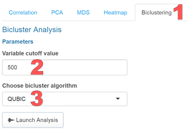\
   
14. Launching the analysis results in display of the first bicluster. 
    Alternative clusters can be selected from the dropdown menu and the IDs 
    and plot for each bicluster can be downloaded using the button below the
    visualization. *With the sample data, the biclusters can help select the 
    samples under which certain gene IDs are similarly expressed. Since gene
    expression levels can vary greatly over all samples and conditions, a
    biclustering approach can isolate similar expression patterns on a level 
    where traditional clustering may miss. The first cluster for the example 
    data shows that samples B20715, D21515, and H12915 are expressed similarly 
    under the isolated gene IDs. Interpretations can be made similarly for 
    each subsequent bicluster:*
    
   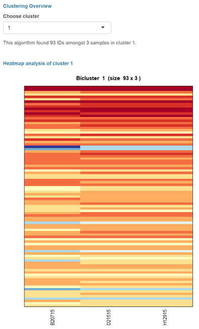\
   
15. The `Clustering` tab allows for users to select one of three clustering
    methods respectively representing hierarchical, representative, and
    graph-based clustering: Weighted Gene Co-expression Network Analysis
    (WGCNA), k-medoids, and the Markov Clustering Algorithm (MCL). While all
    three methods have demonstrated high performance related to module
    detection, the default is WGCNA due to it being the best of the three.
    Here, users should be careful with large datasets, as these methods can
    take large amounts of time to run. Setting the variable cutoff option lower
    will reduce the time by selecting fewer of the most differentially
    expressed genes to use in clustering.
    
   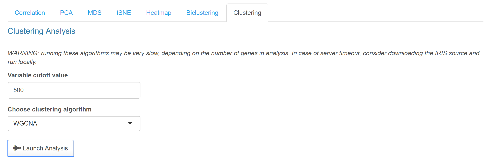\
   
16. The WGCNA method generates figures related to sample and gene dendrograms,
    as well as a topological overlap matrix based on the genes. Additionally,
    users can download lists of the genes and samples with respective cluster
    assignments.
    
   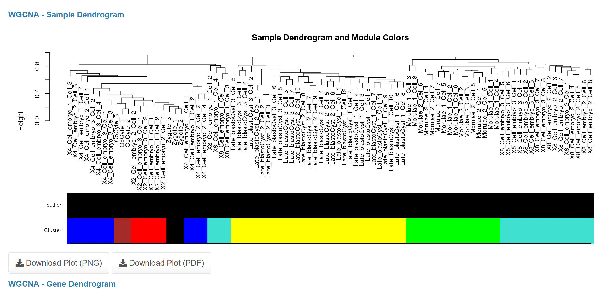\

   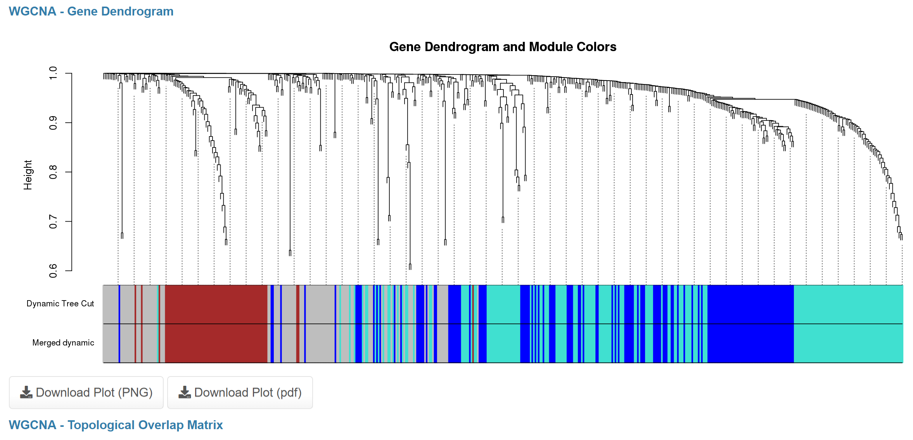\

   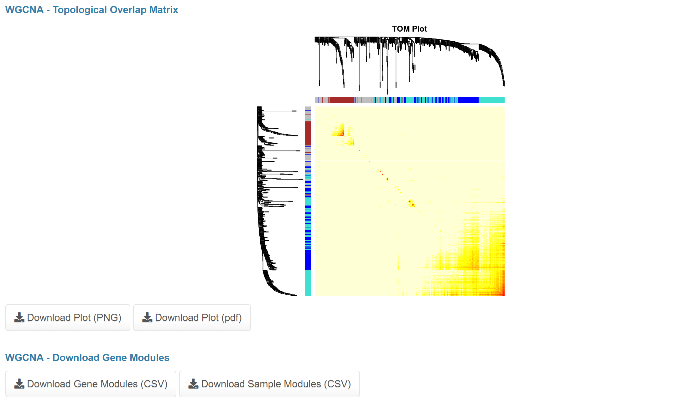\
   
17. The k-medoids method produces a downloadable consensus matrix heatmap.
    Additionally, the generated clusters from this method are downloadable.
    
   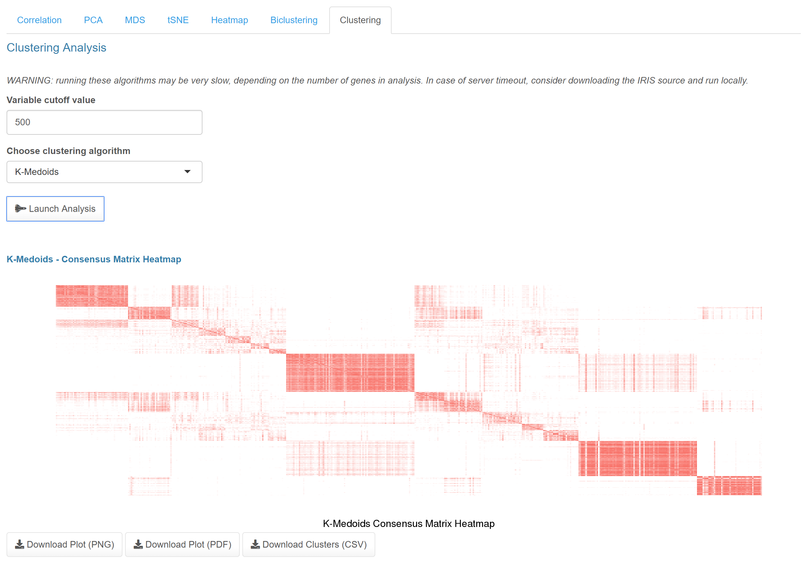\
   
18. The MCL method generates a cluster diagram, along with downloadable cluster
    compositions.
    
   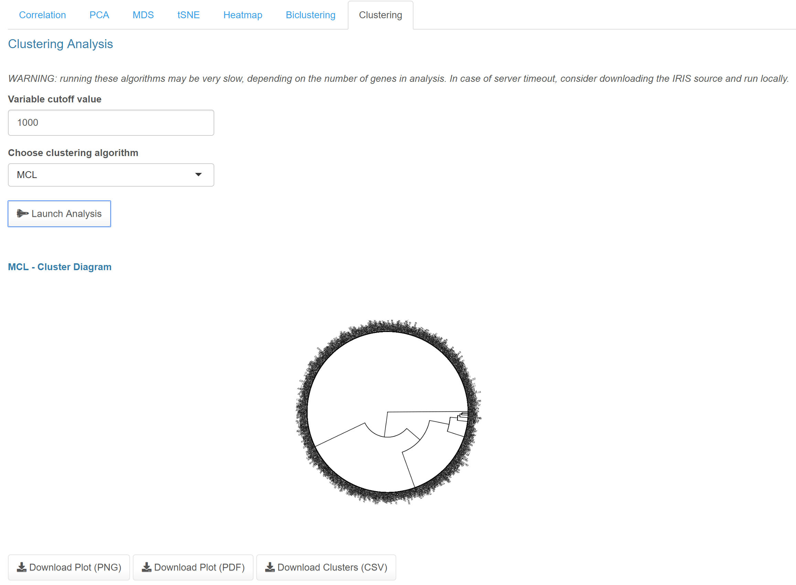\


# S7: Differential Gene Expression

1.  After uploading the user data or selecting the example data, users can go 
    directly to the `DGE Analysis` tab, preceding the `Discovery-Driven Analyses` 
    functions:
    
   \
   
2.  Once you are on this tab, you will be greeted with several options. 
    `1. Experimental Setup` will allow users to select an experimental design 
    for their DGE analysis. Options are Two-group comparison, Multiple factor
    comparisons, Classical interaction design, Additive models (paired or 
    blocking designs), Main effects, Main effects with grouping factors, or 
    Custom design:
    
   \    

## S7.1: An overview of experimental designs
1.  The `Two-group comparisons` options is the traditional approach for DGE and 
    compares two factors levels for the selected factor type. *With the example
    data, selecting "Two group comparisons" for the experimental design and
    "Rootstock" for the factor allows for specific pairwise comparisons of 
    Rootstock factor levels. Here, we can select specific comparisons of 
    interest from the permutations of all pairwise comparisons. Selecting all
    comparison options will provide inverse duplications, so specific 
    selections may be needed. Below, all unique pairwise combinations are 
    selected. The linear model is also displayed for users interested in the 
    model used for comparisons:*
    
   \    
    
2.  The `Multiple factor comparisons` design has users select two factor levels 
    and performs all crosswise comparisons for the two chosen factor levels. 
    *With the example data, the Multiple factor comparisons design with 
    Rootstock and Block selected as the two factors provides optional 
    comparisons for each rootstock separated by block. In this situation, as 
    with the other designs, the user selects which comparisons are of interest. 
    Selecting C3309_B_VS_C3309_E allows for a comparisons of gene expression 
    levels for the same rootstock in two different blocks. This provides 
    insight into the locations and possibly time (due to time requirements for
    sampling) for this specific rootstock:*
    
   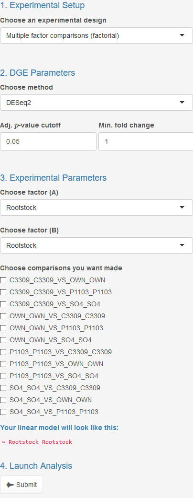\    
    
3.  The `Classical interaction design` allows the user to select two factor 
    levels and one reference level for each of the selected factors. *With the 
    experimental data, the Classic interaction design allows for selection of 
    two factors and a reference for each. In this case, the Rootstock and Row 
    are the chosen factors and OWN and 15 are the selected reference levels for
    comparison. The contrast levels selected upon submission will provide DEGs 
    with respect to these two levels:*

   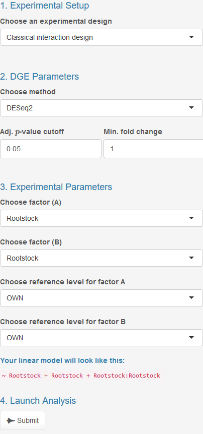\    

4.  The `Additive models` design is useful when samples are paired or blocked 
    into distinct groupings. This format requires selected factors, one for 
    the pairing or blocking factor and the other for the treatment factor.
    Additionally, a reference level for each selected factor is required. *In 
    the example data, the Rootstock factor can be considered for grouping and 
    the treatment factor is Block. OWN is selected as the reference level for 
    the blocking factor and the A15 Block is selected for the treatment 
    reference level:*
    
   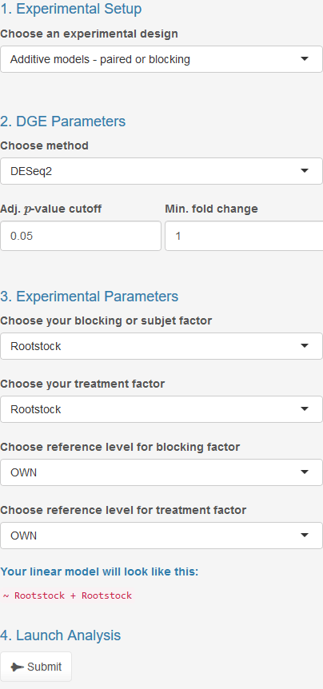\    

5.  `Main Effects` experimental design allows for testing the significance of a 
    factor across multiple factor levels. In this situation, any significant
    deviation from an intercept would result in a significantly differential 
    expressed gene. Using this approach is most useful when users want to test 
    the significance of a factor that has more than two levels. This design 
    requires indication of which factor to test as the main effect. 
    Additionally, users must specify a factor reference level for the lfc and 
    for corresponding visualizations. The $p$-values, adjusted $p$-values, and 
    related differentially expressed genes are not affected by the selected
    reference level. *In the example data, the Rootstock factor is selected, 
    which will test whether Rootstock has a significant impact on the genetic 
    expression across all Rootstock factor levels. Selection of the C3309 
    Rootstock factor level as a reference will provide lfc values and 
    visualizations relative to this level, while $p$-values and adjusted 
    $p$-values will be calculated with respect to the main effect of the 
    chosen factor:*
    
   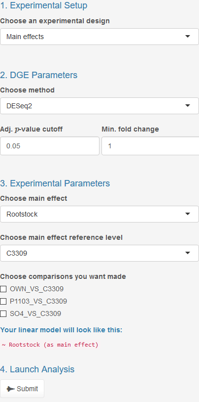\    

6.  `Main effects with grouping factors` design allows for a more detailed main
    effects testing to be performed. This design tests the indicated main 
    effect when the data is subset by a user-indicated factor. Requirements for 
    this design are indication of main effect to test, factor for grouping, and
    grouping factor level for which to provide results. As with the main 
    effects design, the user also specifies a main effect reference level for 
    lfc and visualizations. *In the example data, Rootstock is selected as the
    grouping factor, with C3309 selected as the grouping factor level for which 
    the results table will be based on. The Block factor is selected to test 
    the main effect, with B13 selected as the main effect reference level. This
    analysis will indicate which genes are differentially expressed when 
    account for Block only for the C3309 samples:*
    
   \    

7.  Finally, `Custom design` provides advanced users with a method for 
    indicating their own design matrix. This method is provided so that users 
    can perform more intricate DGE analyses beyond what IRIS-EDA already 
    provides as experimental design options. It is only recommended that users 
    with advanced knowledge of the modeling process to use this option, as the 
    required design matrix may not be intuitive to use appropriately:
    
   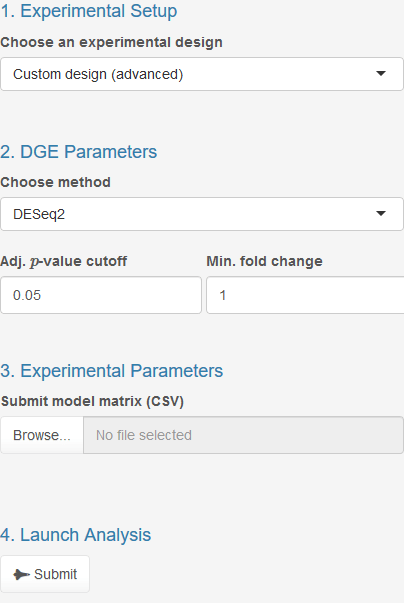\    
    

## S7.2: Setting up an experiment
1.  Following experimental design selection, the user can then select the 
    desired tool for performing differential gene expression analysis. This 
    will be found under `2. DGE Parameters`. Options for this purpose are 
    `DESeq2`, `edgeR`, and `limma-voom`. If the user selects one of the main 
    effects design options, the only options for DGE tools are `DESeq2` and 
    `edgeR`:
    
   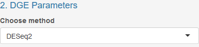\

2.  Also under `2. DGE Parameters`, adjusted $p$-value and log-fold change 
    cutoffs can be specified to filter the results provided. The default values 
    are 0.05 for adjusted $p$-value and 1 for the minimum log-fold change. To
    provide all gene comparisons, select 1 for adjusted $p$-value cutoff and 0 
    for the minimum log-fold change: 

   \

3.  Upon indication of the experimental design, DGE tool and cutoffs, the 
    parameters and comparisons for the specified analysis must be provided. 
    Such parameters can be found under `3. Experimental Parameters`. Depending 
    on the selected experimental design, the required parameters and 
    comparisons will vary:

   \

4.  Launching the analysis will perform the DGE analysis and provide results. 
    This is found under `4. Launch Analysis`. **Note:** Be mindful that this 
    process may take more time than previous steps. Adjusting the cutoff 
    values after submission will automatically update the generated 
    visualizations and results table:
    
   \
   
5.  If you haven't crashed your computer or our server, the main page will now
    be populated with data in the two subtabs: `Overview` and `Plots`.
    
6.  The `Overview` subtab (1) will display information based on the number of 
    differentially expressed genes (DEGs), including a table of significantly
    up- and down-regulated gene ID counts by selected comparisons (2) and an 
    interactive barplot representing this data (3). *With the example data, the 
    results show only one gene is differentially expressed in either direction
    from the two-group comparison based on the Rootstock factor. This 
    information seems to follow with the previously investigated figures 
    showing limited clustering of samples from the PCA and MDS and high
    correlation values between samples:*
    
   \
   
7.  The `Plots` subtab (1) will provides interactive visualizations based on the
    differential expression analysis as well as the actual results file from 
    the previously-selected tool based on the selected comparison. The MA plot (2)
    shows the transformed log-fold change compared to the transformed base 
    mean for each gene ID. Specific points can be selected, highlighting both 
    the point and the corresponding row in the results table found below the 
    figure. Additionally, the gene ID can be selected from the results table, 
    which will highlight the location of that gene ID on the figure:
   
  \
    
8.  The Volcano plot shows a comparison of the transformed $p$-value compared 
    with the transformed log-fold change. As with the MA plot, the Volcano plot 
    is interactively connected with the results table found below the figure:
    
  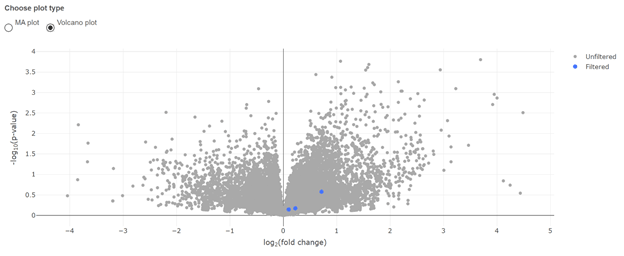\
  
9. Finally, the results table is generated in coordination with the above plots 
   and displays the output file of the selected tool's differential gene 
   expression analysis. This table can be sorted increasingly or decreasingly 
   by any of column. The integrated search feature also allows for specific 
   gene IDs to be found in the table. This results file can be exported in a
   filtered or unfiltered format. *With the example data, sorting by adjusted 
   $p$-value (padj) shows that there are no differentially expressed genes for 
   this specific comparison (C3309 vs. OWN):* 
    
  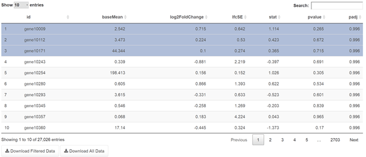\


# S8: GEO Usage

## S8.1: Overview
GEO (**G**ene **E**xpression **O**mnibus) is a public data repository that
accepts array- and high throughput sequence-based data. To submit data to GEO,
you will need three components:

  * Metadata spreadsheet
  * Processed data files
  * Raw data files

The `GEO` section of this web server will aid in the production of two
of the prior components: **metadata and processed data generation.**
This works by having the user fill out a dynamic questionnaire
which follows the template foundation located on NCBI's servers shown
[here](https://www.ncbi.nlm.nih.gov/geo/info/seq.html). While
the user fills out this form, IRIS-EDA will automatically parse your
raw count data into seperate text files based on the number of samples
found in your raw count matrix. This can be downloaded via ZIP file.
Additionally, the information provided by the column data matrix will
be used to populate several components of the metadata, including
sample information, characteristics, and
[MD5 checksum generation](https://en.wikipedia.org/wiki/MD5).

To get started, you *must* load both the raw count data and sample
information on the `Submit and QC` tab. If you do not and head
directly to the `GEO` tab, you will be greeted with a page that looks
like this:

\

## S8.2: Series
After you have successfully submitted your sample data and sample
information, the first section that you will need to fill out is the
**Series** section. This section describes the overall experiment.
Specifically, there are six major components:

  1.  **Title**: a unique title (*less than 255 characters*) that
      describes the overall study.

  2.  **Summary**: a *thorough* description of the goals and objectives
      of this study. The abstract from the associated publication may
      be suitabe. You may provide as much text here as necessary.

  3.  **Overall design**: Indicate how many samples are analyzed, if
      replicates are included, are there control and/or reference
      Samples, etc.

  4.  **Contributor(s)**: Who contributed to this study? You must
      provide the information in the following format
      (`Firstname,Initial,Lastname`). Examples of this format:

        * "Brandon,T,Monier"
        * "Jane,Doe"

      This component is dynamic in this framework. If there was more
      than one contributor, click the `Add Contributor` button to add
      as many individuals who aided in this endeavor.
  5.  **Supplementary file**: If you want to submit your raw count
      matrix provided earlier, include the file name here (**optional**).

  6.  **SRA center name code**: Only enter a value if your institute
      already has a `Center_Name` code registered with SRA. Otherwise,
      leave empty (**optional**).


## S8.3: Samples
This section lists and describes each of the biological Samples
under investgation, as well as any protocols that are specific
to individual Samples. Additional "processed data files" or "raw files"
may be included.

Additionally, this section is dynamically generated. The tabs that will
populate this section will be based on the number of samples you have
submitted for analysis. For example, the "small example data set"
has seven samples, therefore the number of tabs that would have to
be filled out would be seven:

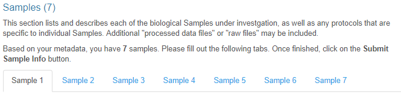\

**It is mandatory that you fill out all samples.** In order for the
spreadsheet to properly be formatted, all of these sample tabs need to
be filled out. Each sample has the following criteria:

  1.  **Sample name**: This will automatically be filled out for you.
      This provides an unique identifier for each sample that will
      not affect any downstream naming schemes.

  2.  **Title**: A unique title that describes the sample.

  3.  **Source name**: Briefly identfiy the biological material.
      (e.g. vastus lateralis muscle)

  4.  **Organism**: Identify the organism(s) from which the
      sequences were derived.

  5.  **Molecule**: The type of molecule that was extracted from the
      biological material. Choose from one of the preselected items
      from the dropdown input.

  6.  **Description**: Additional information not provided in the
      other fields, or paste in broad descriptions that cannot be
      easily dissected into the other fields.

  7.  **Processed data file**: The name of the file containing the
      processed data. **Note (1)**: This step has partially been
      completed for you. This will be the individual sample text
      file of raw counts. If you have more than one processed data
      file that you would like to contribute to GEO, click the
      `Add Proc. Data File` button to add as many entries you need.

  8.  **Raw file**: The name of the file containing the raw data.
      Similar to the processed data, additional raw data can be
      provided by clicking the `Add Raw Data File` button.

**Note (2)**: If you have taken a look at the metadata template before,
you will also notice that this section contains a characteristic column.
This column is automatically generated for you based on your sample
information provided in conjuntion with your raw count matrix. For example,
the "small example data set" contains the following columns of conditions:

  * condition
  * type

Therefore, **two** characteristics columns will be generated in the
spreadsheet. Each of the rows in these columns will based on the factor
levels for each condition.


## S8.4: Protocols
This section provides the public with information about what protocols
were used to conduct this experiment. This section has the following criteria:

  1.  **Growth protocol**: Describe the conditions that were used to
      grow or maintain organisms or cells prior to extract
      preparation (**optional**).

  2.  **Treatment protocol**: Describe the treatments applied to the
      biological material prior to extract preparation.

  3.  **Extract prototocol**: Describe the protocols used to extract and
      prepare the material to be sequenced.

  4.  **Library construction protocol**: Describe the library construction
      protocol.

  5.  **Library strategy**: A Short Read Archive-specific field that
      describes the sequencing technique for this library. Choose from one
      of the preselected items from the dropdown input.


## S8.5: Data processing pipeline
This section includes steps for various data processing techniques.
Base-calling, alignment, filtering, peak-calling, generation of normalized,
abundance measurements, etc.

  1.  **Data processing step**: Provide details of how processed data were
      generated. This can include procedures described in the paragraph
      above. Similar to prior steps, this section is dynamic. To add more
      steps, click the `Add Data Proc. Step` butto.

  2.  **Genome build**: UCSC or NCBI genome build number (e.g. hg18,
      mm9, etc.) or reference sequence used for read alignment.

  3.  **Processed data files format and content**: For each processed
      data file type, provide a description of the format and content. 


## S8.6: Processed data files
For each file that you provided additional processed data in the 
`Samples` section, you will need to provide additional information about 
these files below:

  1.  **File type**: The type of processed file. Examples include, peak,
      wig, bed, gff, bigWig, etc.

  2.  **MD5 file checksum**: MD5 checksum of the file. This helps GEO
      verify that the file transfer was complete and didn't corrupt your 
      file.


## S8.7: Raw files
Similar to the `Processed data files` section above, for each file listed
in the "raw files" of the `Samples` section, provide additional information
about these files below:

  1.  **File name**: The name of the file provided in the `Samples` section.

  2.  **File type**: The type of processed file. Examples include, peak,
      wig, bed, gff, bigWig, etc.

  3.  **MD5 file checksum**: MD5 checksum of the file. This helps GEO
      verify that the file transfer was complete and didn't corrupt your 
      file.

  4.  **Instrument model**: Include the instrument make and model used to
      sequence the samples. Choose from one of the preselected items from 
      the dropdown input.

  5.  **Read length**: The number of bases expected in each raw sequence. 
      If you are using variable read length technology (e.g. 454, PacBio,
      Ion Torrent), put `0` for variable read length.

  6.  **Single or paired-end**: Choose either if your samples were sequenced
      with single reads or paired-end reads. If you used SOLiD technology,
      choose `SOLiD` in the options. **This is critical for the final 
      section**.


## S8.8: Paired-end experiments / SOLiD data
This section will only need to be filled out if your raw files used
paired-end or SOLiD-based sequencing technologies. For paired-end experiments,
list the 2 associated raw files, along with some additional information:

  1.  **File name 1**: Paired-end read 1.

  2.  **File name 2**: Paired-end read 2.

  3.  **Average instert size**: Average size of the insert for paired-end
      reads.

  4.  **Standard deviation**: Standard deviation of insert size. This is
      typically around 10% of the insert size stated.

**Note (1)**: The previously mentioned components are for standard 
paired-end read sets only. If your raw reads used SOLiD technology, this
section will may appear void of any information (see example):


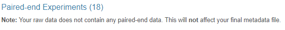\

Instead of 2 reads, you will need to provide 4 (due to the basis of this 
technology) In the final section before the downloads portion. Therfore, 
instead of 2 "File names", You will be prompted to fill out 4; each 
corresponding to their respective read.


## S8.9: Downloads
After you have submitted all of your information, you can download two items:
  
  * An Excel spreadsheet of the metadata;
  * A ZIP file of individual sample reads as text files.


# S9: Using large expression matrices
For users interested in analyzing large expression matrices, commonly
experienced in single-cell analyses, we have proposed the following
best-practices.

First, users should locally load the IRIS-EDA tool. Using the webserver version
with large datasets will frequently lead to disconnecting from the server due
to time constraints. Instructions for how to run locally can be found in
S2: Accessibility.

Second, certain functionalities may either take too long to run or will not
generate usable information. Because of this, we recommend using only the
following functionalities within IRIS-EDA for large expression matrices:

  1.  PCA

  2.  MDS

  3.  t-SNE

  4.  biclustering with QUBIC

Users with large datasets should expect significant wait times for each
analysis, even when using the above list.


# S10: References
Hardcastle TJ, Kelly KA. baySeq: empirical Bayesian methods for identifying differential expression in sequence count data, BMC Bioinformatics 2010;11:422                                

Li J, Tibshirani R. Finding consistent patterns: a nonparametric approach for identifying differential expression in RNA-Seq data, Statistical methods in medical research 2013;22:519-536

Love MI, Huber W, Anders S. Moderated estimation of fold change and dispersion for RNA-seq data with DESeq2, Genome Biol 2014;15:550                                                      

Ritchie ME, Phipson B, Wu D et al. limma powers differential expression analyses for RNA-sequencing and microarray studies, Nucleic Acids Res 2015;43:e47-e47                             

Robinson MD, McCarthy DJ, Smyth GK. edgeR: a Bioconductor package for differential expression analysis of digital gene expression data, Bioinformatics 2010;26:139-140

Tarazona S, Garc?a F, Ferrer A et al. NOIseq: a RNA-seq differential expression method robust for sequencing depth biases, EMBnet. journal 2012;17:pp. 18-19                              

Trapnell C, Roberts A, Goff L et al. Differential gene and transcript expression analysis of RNA-seq experiments with TopHat and Cufflinks, Nat Protoc 2012;7:562-578                     

Trapnell C, Hendrickson DG, Sauvageau M et al. Differential analysis of gene regulation at transcript resolution with RNA-seq, Nat Biotechnol 2013;31:46-53                               

Wang L, Feng Z, Wang X et al. DEGseq: an R package for identifying differentially expressed genes from RNA-seq data, Bioinformatics 2009;26:136-138                                       
